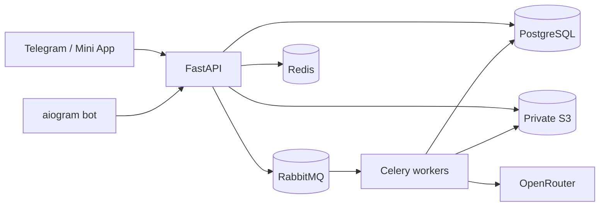

# AI Wardrobe — технический и продуктовый аудит

Дата: 2026-07-28  
Срез: рабочее дерево `E:\AI_wardrobe`, включая изменения текущего engineering loop.

## Вывод

AI Wardrobe уже имеет сильное ядро коммерческого Telegram-продукта: реальную авторизацию Telegram, user-scoped API, PostgreSQL/S3/Celery pipeline, AI-дизайнера, гардероб и образы, privacy receipts, rate limits и структурированные логи. В этом loop добавлены управляемая область распознавания, consent-safe avatar/try-on domain, серверные entitlements, месячные квоты, промокоды и две frontend-сборки.

Текущее состояние — **проверенный commercial preview, но не production-ready релиз**. Основные внешние блокеры: нет включённого и проверенного payment provider/webhook, нет доступного production target для двух вариантов развёртывания, Docker engine локально не стартует, поэтому миграции и полный PostgreSQL/Redis/S3/Celery E2E не подтверждены. Реальная антропометрическая точность аватара не валидирована и не должна называться «один в один».

## Методика и доказательства

- статический аудит Python/TypeScript, маршрутов, моделей, миграций и compose;
- `ruff`, `mypy`, TypeScript typecheck, две Vite-сборки и полный `pytest`;
- синтетический in-process latency benchmark на 500 запросов к двум публичным маршрутам;
- реальный Chromium-проход всех шести вкладок при viewport `390×844`;
- editor QA на синтетическом фото взрослого человека в примерочной с одеждой и манекенами на фоне;
- исследование рынка и provider costs по первичным страницам на 2026-07-28;
- попытка независимого Claude Code Opus review в read-only режиме.

Последний полный проверочный прогон до финальной документационной правки:

- `115 passed`;
- coverage `67.91%`, порог `67%`;
- Ruff lint и Mypy проходят;
- frontend typecheck проходит;
- subscription build: JS `213.61 kB` (`66.66 kB gzip`), CSS `21.32 kB` (`4.71 kB gzip`);
- open build: JS `209.63 kB` (`65.67 kB gzip`), CSS `21.32 kB` (`4.71 kB gzip`).

## Killer features

| Возможность | Почему ценна | Состояние |
|---|---|---|
| Telegram-first wardrobe | Пользователь начинает без отдельной регистрации и работает в привычном канале | Работает; auth, upload, wardrobe и bot pipeline уже существуют |
| Управляемая область распознавания | Можно исключить манекены, вешалки и людей на фоне до отправки в AI | Реализованы proposed central region, drag selection, whole-photo mode, undo/redo/reset, client crop и provenance; semantic person segmentation/brush mask ещё нет |
| Grounded AI-дизайнер | Подбор строится на вещах реального пользователя и отбрасывает неизвестные item IDs | Работает на существующем wardrobe/outfit domain |
| Персональный аватар с согласием | Отдельный профиль пропорций, нейтральная одежда, явный consent и отзыв | Domain/API/UI/worker реализованы; live quality не проверено на реальном лице |
| Виртуальная примерка своих вещей | Асинхронная примерка выбранных вещей на сгенерированном аватаре | Реальный provider adapter подключён через OpenRouter; без ключа честно возвращается `provider_not_configured` |
| Privacy lifecycle | Производные avatar/try-on изображения удаляются из S3 при отзыве согласия | Реализовано; исходное фото гардероба не удаляется, но отвязывается от avatar profile |
| Server-side commercial access | Подписка и promo grant вычисляются на сервере, а дорогие операции имеют квоты | Реализованы entitlements, keyed promo hash, user-row quota lock и idempotent AI reservations |
| Одна кодовая база — два продукта | Paywall можно включить или полностью убрать на этапе сборки | `build:subscriptions` и `build:open` создают разные bundles |

## Архитектура

Сильные стороны:

- API и workers разделены; дорогие AI-вызовы не выполняются в request loop;
- user isolation входит в SQL-запросы;
- оригиналы и генерации находятся в private object storage;
- очередь RabbitMQ отделена от Redis cache/result backend;
- provider boundaries централизованы в `LlmGateway`;
- production startup отказывает при дефолтных секретах.

Риски:

- `0001_initial_schema` создаёт схему из текущего `Base.metadata`, а не из immutable snapshot;
- cost_usd остаётся нулём, потому что provider response ещё не нормализует usage/cost;
- нет payment webhook, invoice creation, refund/idempotency ledger;
- нет production OpenTelemetry collector, централизованного error reporting и worker metrics exporter;
- локальная проверка не заменяет production-like load/chaos/E2E.

## UX и дизайн

Визуальный язык согласован: тёплая нейтральная палитра, крупные карточки, явные primary actions и короткие русские подписи. В ходе прохода исправлены:

- обрезание шестого пункта нижней навигации;
- системные горизонтальные scrollbars в гардеробе, дизайнере и Studio;
- обрезанные тарифные карточки и слишком узкое promo input;
- Telegram haptic warnings в обычном Chromium;
- несоответствие preview free-limit (`50`) серверному (`20`).

Главный UX-риск — шесть нижних вкладок уже находятся на пределе ширины 390 px. При дальнейшем росте продукта Studio лучше перенести в профиль/«Ещё» или объединить с дизайнером. Подробности — в `UX_SCREEN_AUDIT.md`.

## Производительность

Публичные маршруты в синтетическом TestClient дают p95 менее 8 ms и около 190 req/s на одном последовательном процессе. Это подтверждает отсутствие очевидного CPU bottleneck в Python на этих маршрутах, но не моделирует сеть, PostgreSQL, Redis, S3, queue lag или AI.

Основной latency budget фактически определяют:

1. upload/egress изображения;
2. очередь;
3. OpenRouter/provider generation;
4. обработка и сохранение нескольких product images;
5. frontend waterfall при загрузке гардероба.

Полный перенос на Go **отклонён как необоснованный**: измеренные публичные Python paths быстры, а критические операции I/O-bound. Go стоит обсуждать только после профиля production-like нагрузки, который покажет CPU/GIL bottleneck и окупаемость миграции. См. `PERFORMANCE_BASELINE.md`.

## Коммерческая готовность

Реализовано:

- Free/Premium/Pro catalog;
- preview prices `0 / 699 / 1490 RUB`;
- 20/500/unlimited items и 5/100/unlimited AI analyses;
- Premium: 2 avatar generations и 6 try-ons в месяц;
- Pro: 5 avatar generations и 15 try-ons в месяц;
- effective access из legacy profile, active subscription и promo grant;
- одноразовые promo grants с 24-часовой длительностью;
- `ENABLE_BILLING_PAYMENTS=false` по умолчанию.

Не реализовано и поэтому payments остаются выключены:

- provider invoices/webhooks/refunds;
- точный per-request cost ingestion;
- налоговая/юридическая модель и storefront commission;
- hosted production deploy и rollback smoke.

## Приоритет оставшихся работ

### P0 до включения платежей

1. Зафиксировать immutable migration baseline вместо live metadata; локальные fresh/committed-schema прогоны уже
   выполнены, но нужен schema-only dump production и restore drill.
2. Подключить payment provider с signed webhook, idempotency и reconciliation.
3. Собирать фактические tokens/credits/cost в `ai_requests`.
4. Прогнать S3/Celery/provider E2E и конкурентное погашение promo; PostgreSQL/Redis/promo HTTP smoke уже подтверждены.
5. Провести privacy/legal review для face/body processing и retention.

### P1 до публичной beta

1. Добавить локальную semantic person/garment segmentation и brush add/subtract.
2. Ввести provider-specific try-on adapter с формализованными privacy guarantees.
3. Добавить Playwright E2E, axe/accessibility и visual snapshots в CI.
4. Добавить OpenTelemetry traces, worker/provider metrics и alerts.
5. Провести production-like load и failure injection.

## Решение

Основной локально проверяемый scope принят. Утверждения «готовый навсегда продукт», «точность один в один» и «production deploy выполнен» отклонены как недоказуемые. Точная матрица готовности находится в `RELEASE_READINESS.md`.
