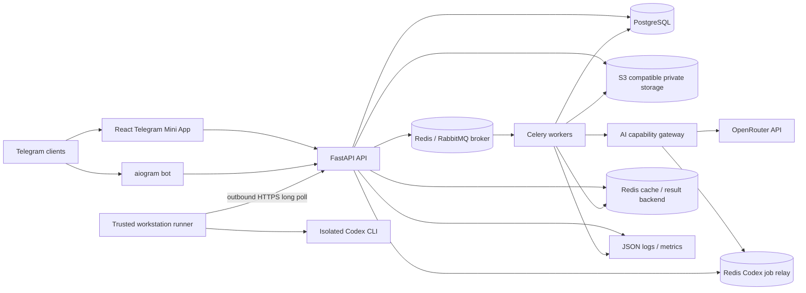
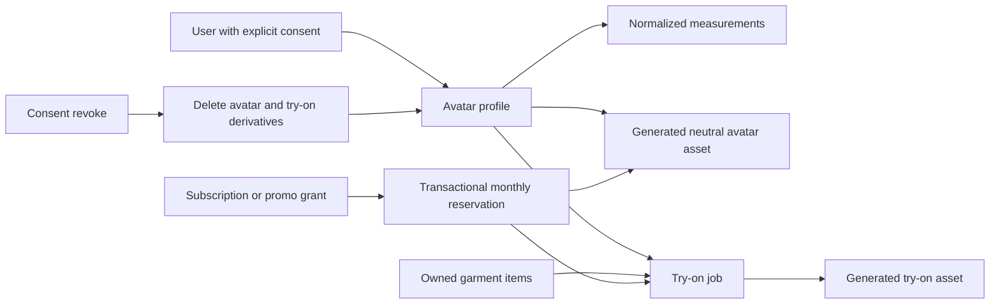

# Architecture

## System Diagram

## Containers

- **Telegram Bot** receives commands/photos and delegates business work to the backend.
- **Mini App** is the primary mobile-first UI inside Telegram WebView.
- **FastAPI API** owns auth, DTOs, domain orchestration and public HTTP contracts.
- **Celery Workers** own image analysis, provider calls, research, recommendations and notifications.
- **PostgreSQL** stores relational domain data and JSONB designer attributes.
- **Redis** stores cache state, Celery task results, rate-limit counters, short task state and idempotency keys.
- **S3-compatible storage** stores private originals, processed images, thumbnails, generated references and share cards.
- **RabbitMQ** is recommended as the production Celery broker when durable delivery and broker observability matter.

## Domain Boundaries

- Telegram handlers never contain wardrobe business logic.
- API schemas are Pydantic DTOs and remain separate from SQLAlchemy ORM models.
- LLM Gateway is the only AI-provider boundary and is responsible for capability routing, fallback, model IDs, strict
  JSON validation and provider/model accounting.
- Codex CLI is an analysis/text backend, not a pixel-generation backend. It runs on a trusted workstation, outside the
  public server containers, with saved auth or an explicitly scoped `CODEX_API_KEY`.
- The runner opens only outbound HTTPS connections to hidden bearer-authenticated claim/complete endpoints. Redis jobs,
  images and responses have bounded TTLs; the API never exposes Redis and the workstation has no inbound listener.
- Payment integrations are adapters behind a provider-neutral billing layer.

## AI Pipeline

1. User uploads an image through bot or Mini App. In the Mini App the user can accept the whole photo or confirm a
   pointer/keyboard-adjustable rectangle; the browser crops exactly that region before upload.
2. Backend stores original image metadata, normalized selection provenance and an idempotent billable analysis
   reservation, then creates an upload task.
3. Worker receives a signed read URL with short TTL and finalizes the existing reservation instead of creating a second
   usage event.
4. LLM Gateway selects OpenRouter, the local Codex runner, or the configured hybrid order and detects every garment
   (max 6). The runner must have a fresh Redis heartbeat; otherwise hybrid mode falls back without waiting for the job
   timeout. Codex receives the inline image as an ephemeral local file and treats visible text as untrusted data.
5. JSON response is constrained by strict JSON Schema where supported and always validated against Pydantic schemas.
6. For each detected garment the worker asks the image-generation model (`OPENROUTER_MODEL_IMAGE_GEN`) for a
   marketplace-style product photo on a clean background (`PRODUCT_IMAGE_BACKGROUND`: white or dark). The prompt
   forbids changing color/cut/defects, and on failure the card falls back to the normalized original photo.
7. Backend persists one garment card per detected item; a look photo with several garments also becomes a LookCard
   linking those items. Privacy receipt is stored as before.
8. Bot notification or Mini App status view surfaces the result; the user gets a Telegram message when some garments
   could not be carded or could not get a product photo.

Research must use only text extracted from the item description. Private photos, face data and body assessment are out of bounds.

### AI capability matrix

| Capability | OpenRouter API | Local Codex runner | Hybrid behavior |
|---|---:|---:|---|
| Garment/look image understanding | yes | yes | ordered fallback |
| Research/designer/outfit JSON | yes | yes | ordered fallback |
| Product-card pixel generation | yes | no | API only, local normalization fallback |
| Avatar/try-on pixel generation | yes | no | API only, explicit unavailable state |

Every `ai_requests` completion and privacy receipt records the provider/model actually used. Provider failures log only
operation, provider and error type; prompts, image data and raw CLI stderr are excluded.

## Avatar, entitlements and data lifecycle

- Effective features are resolved server-side from an active subscription or unexpired promo redemption.
- `ai_requests` is the auditable reservation ledger for analysis, avatar and try-on limits; failed requests do not
  consume the monthly allowance.
- Promo plaintext is returned only by the creation tool. PostgreSQL stores an HMAC hash and enforces per-user,
  validity-window and redemption-count rules.
- Revoking avatar consent removes generated avatar/try-on objects and measurements, clears the reference link and keeps
  the independently owned wardrobe original.
- Payments remain behind `ENABLE_BILLING_PAYMENTS=false` until a signed idempotent webhook/refund integration exists.

## Scaling

- API and LLM Gateway are stateless; runner jobs use Redis as bounded coordination state.
- Workers scale by queue: `ai`, `research`, `recommendations`, `notifications`.
- A single runner is suitable for testing. Production runner throughput must be increased with an explicit concurrency
  policy and account-capacity measurements before relying on it as the only analysis provider.
- PostgreSQL can move to primary + read replica.
- Redis can move to a managed cluster.
- Object storage can move from MinIO to any S3-compatible provider.

## Broker Decision

Redis remains required for cache-like state, task results and low-latency counters. RabbitMQ is a better production broker
for Celery queues because it gives durable queues, acknowledgements and clearer queue operations. Kafka is not recommended
for the current v0.2.2 scope: the product needs command-style background jobs, not high-throughput immutable event streams.
Kafka should be revisited only after an outbox/event-ledger requirement appears for analytics, marketplace ingestion or
multi-service synchronization.

## Database Schema

```mermaid
erDiagram
    users {
        uuid id PK
        bigint telegram_id UK
        text telegram_username
        text first_name
        text language
        text timezone
        text city
        text subscription_plan
        text privacy_mode
        timestamp created_at
        timestamp updated_at
        timestamp deleted_at
    }

    roles {
        uuid id PK
        text code UK
        text description
    }

    sessions {
        uuid id PK
        uuid user_id FK
        text refresh_token_hash UK
        text user_agent
        text ip_hash
        timestamp expires_at
        timestamp revoked_at
    }

    image_assets {
        uuid id PK
        uuid user_id FK
        text storage_key UK
        text content_type
        bigint size_bytes
        text provenance_label
        text checksum_sha256
        timestamp deleted_at
    }

    uploads {
        uuid id PK
        uuid user_id FK
        uuid original_image_id FK
        text upload_type
        text filename
        text status
        text error_code
        text error_message
        numeric confidence
        timestamp completed_at
    }

    image_selections {
        uuid id PK
        uuid upload_id FK,UK
        uuid user_id FK
        text kind
        text source
        jsonb geometry
        timestamp confirmed_at
    }

    garment_items {
        uuid id PK
        uuid user_id FK
        uuid source_upload_id FK
        uuid original_image_id FK
        text title
        text category
        text main_color
        jsonb season
        jsonb style_archetype
        jsonb designer_attributes
        text status
        text availability_status
        numeric confidence
    }

    look_cards {
        uuid id PK
        uuid user_id FK
        uuid source_upload_id FK
        text title
        jsonb style_tags
        jsonb designer_reasoning
        numeric confidence
        boolean is_favorite
    }

    look_items {
        uuid look_id FK
        uuid item_id FK
        text role
    }

    outfit_cards {
        uuid id PK
        uuid user_id FK
        text title
        jsonb generation_context
        jsonb designer_reasoning
        numeric score
        numeric comfort_score
        boolean is_favorite
    }

    outfit_items {
        uuid outfit_id FK
        uuid item_id FK
        text role
    }

    ai_requests {
        uuid id PK
        uuid user_id FK
        uuid task_id
        text model
        text request_type
        text status
        numeric cost_usd
        text error_code
        timestamp created_at
    }

    event_contexts {
        uuid id PK
        uuid user_id FK
        text event_type
        text dress_code
        jsonb weather
        timestamp starts_at
    }

    outfit_generation_requests {
        uuid id PK
        uuid user_id FK
        uuid outfit_id FK
        jsonb anchor_item_ids
        jsonb context_payload
        text status
    }

    marketplace_results {
        uuid id PK
        uuid user_id FK
        uuid source_item_id FK
        text marketplace
        text title
        text url
        numeric price
        numeric match_confidence
        text trust_label
    }

    missing_item_cards {
        uuid id PK
        uuid user_id FK
        text title
        text category
        text priority
        jsonb reasoning
    }

    wishlist_items {
        uuid id PK
        uuid user_id FK
        text title
        text source_url
        text status
        text notes
    }

    style_dna {
        uuid user_id PK
        jsonb dominant_styles
        jsonb avoided_styles
        jsonb preferred_color_families
        jsonb avoided_color_families
        numeric confidence
    }

    user_style_rules {
        uuid id PK
        uuid user_id FK
        text natural_language_rule
        jsonb parsed_rule
        boolean enabled
    }

    outfit_memories {
        uuid id PK
        uuid user_id FK
        uuid outfit_id FK
        text feedback
        jsonb context
    }

    wardrobe_health_snapshots {
        uuid id PK
        uuid user_id FK
        numeric score
        jsonb coverage_by_season
        jsonb coverage_by_event
        jsonb missing_roles
        jsonb duplicate_groups
    }

    privacy_receipts {
        uuid id PK
        uuid user_id FK
        uuid upload_id FK
        text ai_provider_used
        text model_used
        boolean original_saved
        boolean research_used
        boolean training_allowed
    }

    purchase_simulations {
        uuid id PK
        uuid user_id FK
        text product_description
        text source_url
        numeric buy_score
        numeric duplicate_risk
        integer compatibility_count
        jsonb scenario_coverage
        text recommendation
    }

    notification_settings {
        uuid id PK
        uuid user_id FK
        text channel
        boolean enabled
        jsonb preferences
    }

    subscriptions {
        uuid id PK
        uuid user_id FK
        text plan
        text status
        timestamp active_until
    }

    usage_limits {
        uuid id PK
        uuid user_id FK
        text period_key
        integer item_count
        integer ai_analysis_count
    }

    payments {
        uuid id PK
        uuid user_id FK
        uuid subscription_id FK
        text provider
        text provider_payment_id
        text status
        numeric amount
        text currency
    }

    promo_codes {
        uuid id PK
        text code_hash UK
        text plan
        integer duration_hours
        integer max_redemptions
        integer redemption_count
        timestamp valid_until
        boolean enabled
    }

    promo_redemptions {
        uuid id PK
        uuid promo_code_id FK
        uuid user_id FK
        text plan
        timestamp redeemed_at
        timestamp expires_at
        timestamp revoked_at
    }

    avatar_profiles {
        uuid id PK
        uuid user_id FK,UK
        uuid reference_image_id FK
        uuid generated_image_id FK
        text status
        text consent_version
        timestamp consented_at
        timestamp revoked_at
    }

    avatar_measurements {
        uuid id PK
        uuid avatar_profile_id FK
        text code
        numeric value
        text unit
        text source
        numeric confidence
    }

    try_on_jobs {
        uuid id PK
        uuid user_id FK
        uuid avatar_profile_id FK
        uuid output_image_id FK
        text status
        text provider
        text error_code
    }

    try_on_items {
        uuid try_on_job_id FK
        uuid item_id FK
        integer sort_order
    }

    users ||--o{ sessions : owns
    users ||--o{ image_assets : owns
    users ||--o{ uploads : creates
    image_assets ||--o{ uploads : original
    uploads ||--o| image_selections : scopes
    users ||--o{ image_selections : confirms
    uploads ||--o{ garment_items : source
    uploads ||--o{ look_cards : source
    users ||--o{ garment_items : owns
    users ||--o{ look_cards : owns
    garment_items ||--o{ look_items : used_by
    look_cards ||--o{ look_items : contains
    users ||--o{ outfit_cards : owns
    garment_items ||--o{ outfit_items : used_by
    outfit_cards ||--o{ outfit_items : contains
    users ||--o{ ai_requests : requests
    users ||--o{ event_contexts : plans
    users ||--o{ outfit_generation_requests : asks
    outfit_cards ||--o{ outfit_generation_requests : result
    users ||--o{ marketplace_results : sees
    garment_items ||--o{ marketplace_results : source
    users ||--o{ missing_item_cards : needs
    users ||--o{ wishlist_items : saves
    users ||--|| style_dna : has
    users ||--o{ user_style_rules : defines
    users ||--o{ outfit_memories : remembers
    outfit_cards ||--o{ outfit_memories : feedback
    users ||--o{ wardrobe_health_snapshots : receives
    users ||--o{ privacy_receipts : owns
    uploads ||--o{ privacy_receipts : documents
    users ||--o{ purchase_simulations : runs
    users ||--o{ notification_settings : configures
    users ||--o{ subscriptions : pays_for
    users ||--o{ usage_limits : consumes
    subscriptions ||--o{ payments : paid_by
    users ||--o{ promo_redemptions : redeems
    promo_codes ||--o{ promo_redemptions : grants
    users ||--o| avatar_profiles : configures
    avatar_profiles ||--o{ avatar_measurements : describes
    avatar_profiles ||--o{ try_on_jobs : powers
    users ||--o{ try_on_jobs : requests
    try_on_jobs ||--o{ try_on_items : contains
    garment_items ||--o{ try_on_items : selected
```

