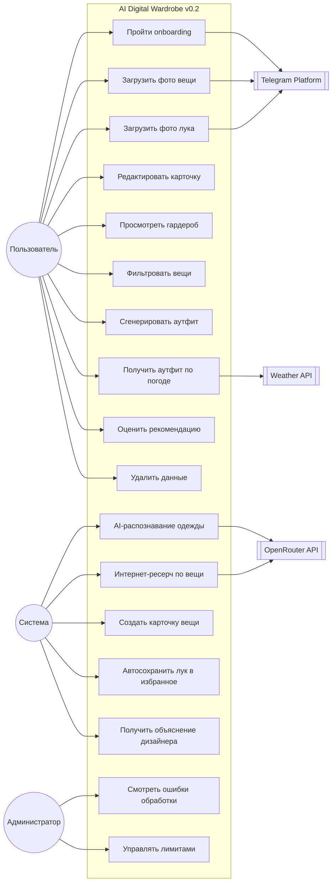
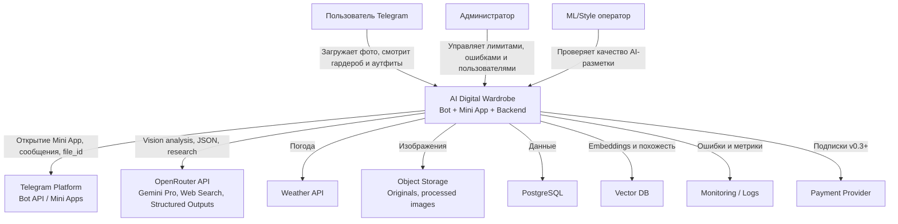
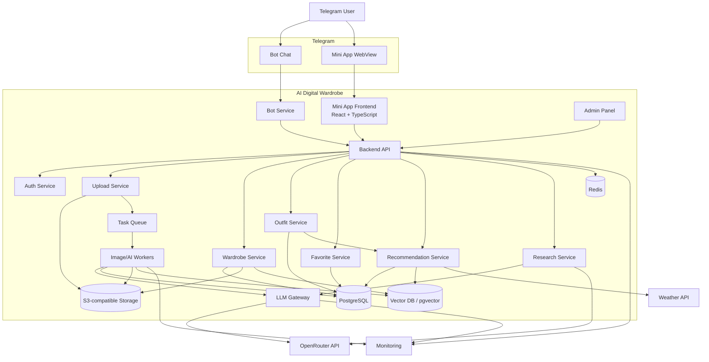
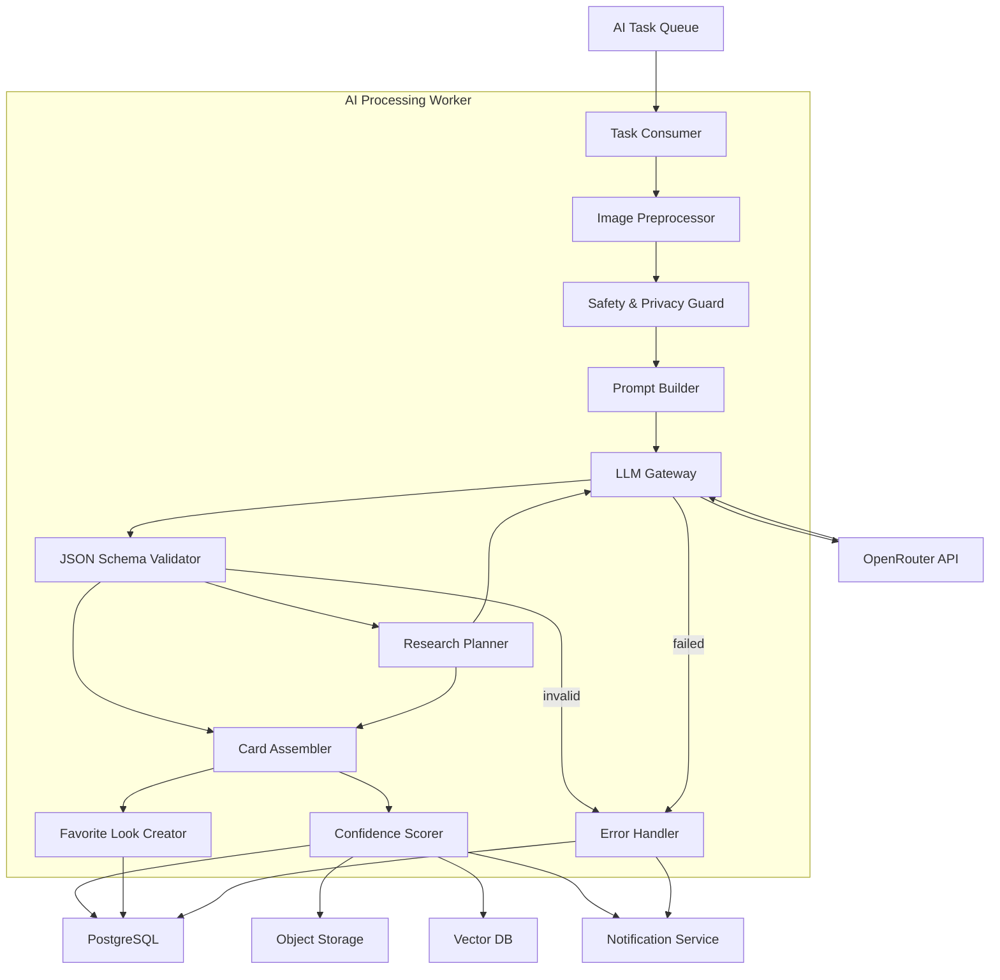
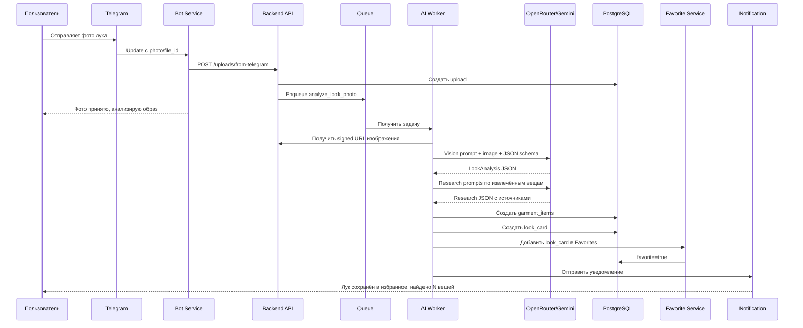
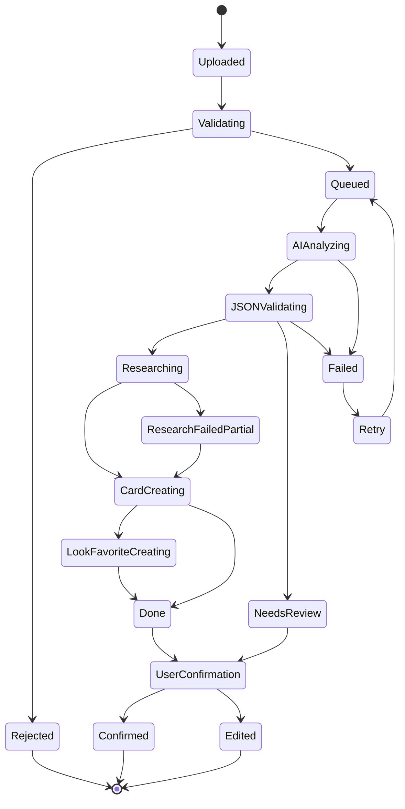

# Техническое задание v0.2.0
# Telegram-бот + Telegram Mini App «AI Digital Wardrobe»

**Версия документа:** 0.2.0  
**Дата:** 2026-05-03  
**Платформа:** Telegram Bot + Telegram Mini App  
**AI-провайдер:** OpenRouter API  
**Целевая модель:** Gemini Pro-класс через OpenRouter: `google/gemini-pro-latest` как основной алиас, с возможностью использовать актуальный Gemini 3/3.1 Pro endpoint при доступности  
**Основной сценарий:** пользователь загружает фото одежды или готового лука, система распознаёт вещи, делает интернет-ресерч, создаёт карточки гардероба и сохраняет загруженный лук в избранное.

---

## 0. Краткое резюме v0.2

Версия 0.2 — релизная спецификация Telegram-продукта, который состоит из:

1. **Telegram-бота** — быстрый вход, загрузка фото, уведомления, команды, утренние рекомендации.
2. **Telegram Mini App** — основной визуальный интерфейс: гардероб, карточки вещей, избранные луки, генератор аутфитов, профиль.
3. **Backend API** — авторизация, бизнес-логика, работа с данными, лимиты, безопасность.
4. **LLM Gateway** — единая прослойка к OpenRouter API.
5. **AI Processing Workers** — фоновые задачи анализа фото, research, создания карточек и рекомендаций.
6. **Recommendation Service** — подбор образов на основе погоды, событий, предпочтений и дизайнерских характеристик вещей.

Главная гипотеза релиза:

> Пользователь отправляет фото одежды или готового образа в Telegram и получает готовую карточку вещи/лука с сезоном, типом, цветовой гаммой, стилистикой, дизайнерской логикой и рекомендациями по сочетанию.

---

## 1. Цели продукта

### 1.1. Цели пользователя

Пользователь хочет:

- быстро оцифровать гардероб без ручного заполнения;
- загрузить фото вещи и получить готовую карточку;
- загрузить фото готового образа и автоматически сохранить его в избранное;
- понять, с чем носить каждую вещь;
- получать образы под погоду, событие, сезон и стиль;
- видеть, почему вещи сочетаются между собой;
- использовать всё внутри Telegram без установки отдельного приложения.

### 1.2. Цели бизнеса

Продукт должен:

- проверить гипотезу AI-гардероба в Telegram;
- минимизировать friction первой загрузки;
- собрать пользовательские corrections для улучшения качества;
- подготовить базу для подписки;
- иметь заменяемую AI-модель через OpenRouter;
- безопасно обрабатывать приватные фотографии.

---

## 2. Границы релиза 0.2

### 2.1. Входит в v0.2

| Модуль | Статус |
|---|---|
| Telegram-бот | Обязательно |
| Telegram Mini App | Обязательно |
| Авторизация через Telegram initData | Обязательно |
| Загрузка фото через бота | Обязательно |
| Загрузка фото через Mini App | Обязательно |
| AI-анализ фото через OpenRouter | Обязательно |
| Gemini Pro-класс модель для определения одежды | Обязательно |
| Structured JSON output | Обязательно |
| Интернет-ресерч по вещи | Обязательно |
| Автоматическое создание карточки вещи | Обязательно |
| Автоматическое сохранение загруженного лука в избранное | Обязательно |
| Ручное редактирование карточек | Обязательно |
| Гардероб с фильтрами | Обязательно |
| Избранные луки | Обязательно |
| Генерация аутфита | Обязательно |
| Подбор по погоде | Обязательно |
| Объяснение дизайнерской логики | Обязательно |
| Базовая админ-панель | Обязательно |
| Удаление аккаунта и данных | Обязательно |

### 2.2. Не входит в v0.2

| Функция | Причина |
|---|---|
| Полноценная виртуальная примерка | Сложная ML-задача, лучше v0.4+ |
| 3D-аватар пользователя | Не нужен для проверки основной гипотезы |
| Маркетплейс одежды | Уводит продукт в e-commerce |
| Социальная лента | Не критично для MVP |
| Human stylist marketplace | Можно добавить после проверки retention |
| Собственное обучение модели на фото пользователей | Только после отдельного согласия и юридической проработки |
| Гарантированное распознавание бренда | Высокий риск ошибок |

---

## 3. Термины

| Термин | Значение |
|---|---|
| Гардероб | Коллекция вещей пользователя |
| Вещь / garment item | Одежда, обувь или аксессуар |
| Карточка вещи | Структурированная запись о вещи с изображением и характеристиками |
| Лук / look | Готовый образ на фото или сохранённый комплект |
| Аутфит / outfit | Сгенерированный или сохранённый комплект вещей |
| Избранное | Раздел с сохранёнными луками и аутфитами |
| Designer attributes | Характеристики, которыми руководствуется стилист при сборке образа |
| Confidence | Уверенность AI в результате |
| Draft item | Черновая карточка, требующая проверки |
| Confirmed item | Подтверждённая карточка |
| LLM Gateway | Backend-сервис для работы с OpenRouter |
| Research Service | Сервис интернет-ресерча по описанию вещи |

---

## 4. Платформенные требования Telegram

### 4.1. Mini App

Mini App должна запускаться:

- из кнопки в боте;
- из меню бота;
- из inline-кнопки;
- через deep link;
- из уведомления о готовности обработки.

Mini App должна:

- использовать Telegram theme params;
- поддерживать light/dark mode;
- уважать safe area;
- использовать Telegram BackButton;
- использовать Telegram MainButton для ключевых действий;
- корректно работать на iOS, Android, Desktop Telegram и Telegram Web;
- не хранить приватные токены в небезопасном localStorage;
- вызывать `Telegram.WebApp.ready()` после загрузки критичного UI.

### 4.2. Бот

Бот используется для:

- первичного входа;
- загрузки фото;
- уведомлений;
- команд;
- утренних рекомендаций;
- открытия Mini App;
- удаления данных.

### 4.3. Ограничения файлов

Для фото через стандартный Bot API в MVP устанавливается ограничение **до 20 MB**. Для больших файлов используется загрузка через Mini App напрямую в object storage по signed URL.

---

## 5. AI-архитектура OpenRouter

### 5.1. Основной принцип

Клиент не обращается к OpenRouter напрямую. Все запросы идут через backend.

```text
Telegram Bot / Mini App → Backend API → LLM Gateway → OpenRouter → Gemini Pro-class model
```

Причины:

- скрытие OpenRouter API key;
- централизованные лимиты;
- retry и fallback;
- подсчёт стоимости;
- контроль промптов;
- JSON Schema validation;
- защита приватности;
- возможность заменить модель без обновления клиента.

### 5.2. Конфигурация модели

`model_id` должен быть конфигурируемым, а не зашитым в код.

```yaml
llm:
  provider: openrouter
  primary_model: google/gemini-pro-latest
  preferred_model_family: gemini-pro
  allowed_models:
    - google/gemini-pro-latest
    - google/gemini-3.1-pro-preview
    - google/gemini-flash-latest
  fallback_model: google/gemini-flash-latest
  require_vision: true
  require_structured_output: true
  require_web_search: true
```

### 5.3. Режимы использования моделей

| Сценарий | Рекомендуемая модель | Режим |
|---|---|---|
| Одна вещь на чистом фото | Gemini Flash/Pro Latest | low/medium |
| Несколько вещей на фото | Gemini Pro Latest / Gemini 3.1 Pro | medium/high |
| Фото лука или mirror selfie | Gemini Pro Latest / Gemini 3.1 Pro | high |
| Интернет-ресерч | Gemini Pro Latest + web search | medium |
| Генерация аутфита | Gemini Pro Latest | medium/high |
| Повторная классификация | Flash fallback | low |

### 5.4. Формат передачи изображений

Поддерживаются:

1. `image_url` с temporary signed URL;
2. base64 image.

Для приватных фото предпочтительно использовать signed URL:

- TTL 5–15 минут;
- read-only;
- без публичного индексирования;
- доступ только для обработки;
- автоматическая инвалидация после завершения задачи.

### 5.5. Web search / internet research

Интернет-ресерч выполняется **только по текстовому описанию вещи**, а не по приватной фотографии.

Запрещено:

- отправлять персональное фото в web search;
- искать по лицу пользователя;
- отправлять координаты пользователя без необходимости;
- использовать web search для приватных данных.

Разрешено:

- искать по извлечённому описанию: `dark olive bomber jacket nylon relaxed fit`;
- искать по типу вещи;
- искать по стилю;
- искать по материалу;
- искать по уходу;
- искать styling references.

---

## 6. Основные пользовательские сценарии

### 6.1. Фото одной вещи

1. Пользователь отправляет фото в бот или Mini App.
2. Backend сохраняет оригинал.
3. Создаётся upload task.
4. LLM Gateway отправляет фото в OpenRouter.
5. Gemini определяет вещь.
6. Research Service делает интернет-ресерч.
7. Backend создаёт карточку вещи.
8. Пользователь видит карточку.
9. Пользователь подтверждает или исправляет данные.

**Acceptance criteria:**

- Фото принимается за ≤ 5 секунд.
- Статус обработки виден пользователю.
- Карточка создаётся автоматически.
- Карточка содержит тип, сезон, гамму, стиль, дизайнерские характеристики.
- Если confidence ниже порога, карточка требует подтверждения.

### 6.2. Фото готового лука

1. Пользователь загружает фото готового образа.
2. Система определяет `image_type = look_photo`.
3. Gemini описывает образ целиком.
4. Gemini выделяет отдельные вещи.
5. Система создаёт `LookCard`.
6. Система создаёт draft-карточки вещей.
7. `LookCard` автоматически сохраняется в “Избранное”.
8. Пользователь может подтвердить вещи и оставить лук как референс.

**Acceptance criteria:**

- Любое фото, классифицированное как `look_photo`, автоматически попадает в “Избранное”.
- Пользователь может удалить лук из избранного.
- Система показывает найденные вещи.
- Лицо и тело не описываются.
- Система объясняет, почему лук стилистически работает.

### 6.3. Генерация аутфита

1. Пользователь нажимает “Что надеть сегодня”.
2. Система получает погоду.
3. Система получает доступные вещи.
4. Recommendation Service применяет правила.
5. LLM генерирует 1–5 вариантов.
6. Система объясняет дизайнерскую логику.
7. Пользователь сохраняет, лайкает, дизлайкает или просит другой вариант.

### 6.4. Генерация по текстовому запросу

Примеры:

- “Собери образ на свидание”.
- “Что надеть в офис при +8 и дожде?”
- “Хочу минималистичный лук с чёрными джинсами”.
- “С чем носить эту куртку?”
- “Собери образ в стиле old money”.
- “Собери капсулу на 3 дня”.

Система должна:

- извлечь intent;
- найти релевантные вещи;
- учесть погоду;
- учесть событие;
- учесть дизайнерские правила;
- вернуть объяснимый результат.

---

## 7. Use Case диаграмма



---

## 8. C4: System Context



---

## 9. C4: Container Diagram



---

## 10. C4: Component Diagram для AI pipeline



---

## 11. Sequence: фото лука → карточки → избранное



---

## 12. Функциональные требования

## 12.1. Telegram-бот

### FR-BOT-001. Команда `/start`

Бот должен:

- приветствовать пользователя;
- объяснять продукт в 1–2 предложениях;
- показывать кнопку “Открыть гардероб”;
- показывать кнопку “Загрузить фото”;
- показывать ссылку на privacy policy;
- создавать профиль пользователя, если его нет.

### FR-BOT-002. Команды

| Команда | Описание |
|---|---|
| `/start` | Начало работы |
| `/app` | Открыть Mini App |
| `/upload` | Инструкция по загрузке фото |
| `/today` | Образ на сегодня |
| `/favorites` | Избранные луки |
| `/wardrobe` | Гардероб |
| `/settings` | Настройки |
| `/delete_me` | Удаление аккаунта |
| `/help` | Помощь |

### FR-BOT-003. Загрузка фото

Бот должен принимать:

- фото одной вещи;
- фото нескольких вещей;
- фото готового лука;
- mirror selfie;
- скриншот товара.

После загрузки бот должен:

- создать задачу обработки;
- отправить статус;
- уведомить о готовности;
- дать кнопку “Открыть результат”.

---

## 12.2. Mini App

### FR-MA-001. Главный экран

Главный экран содержит:

- hero-блок “Что надеть сегодня”;
- погодный виджет;
- CTA “Добавить фото”;
- блок “Последняя обработка”;
- блок “Избранные луки”;
- блок “Недавно добавлено”;
- рекомендации “добавьте обувь”, “подтвердите 3 вещи”;
- быстрый ввод текстового запроса.

### FR-MA-002. Навигация

Нижнее меню:

| Раздел | Назначение |
|---|---|
| Сегодня | Рекомендации и погода |
| Гардероб | Вещи пользователя |
| Добавить | Загрузка фото |
| Избранное | Луки и аутфиты |
| Профиль | Настройки |

### FR-MA-003. Экран “Добавить”

Должен поддерживать:

- загрузку из галереи;
- камеру;
- несколько фото;
- выбор типа загрузки: вещь, лук, определить автоматически;
- progress обработки;
- список задач;
- повторную обработку.

### FR-MA-004. Экран “Гардероб”

Функции:

- сетка карточек;
- фильтры;
- поиск;
- сортировка;
- группировка по категориям;
- быстрые chips: Верх, Низ, Обувь, Верхняя одежда, Аксессуары, Зима, Лето, База, Акценты, Требует проверки.

### FR-MA-005. Экран “Избранное”

Содержит:

- автоматически сохранённые загруженные луки;
- сохранённые AI-аутфиты;
- ручные подборки;
- фильтр по сезону;
- фильтр по событию;
- фильтр по стилю;
- действие “собрать похожий образ”.

---

## 13. Карточка вещи

### 13.1. Обязательные поля

| Поле | Описание |
|---|---|
| Название | Человеческое имя вещи |
| Категория | Верх, низ, обувь, аксессуар и т.д. |
| Подкатегория | Футболка, джинсы, ботинки и т.д. |
| Фото | Обработанное изображение |
| Исходное фото | Приватно, доступно только владельцу |
| Цветовая гамма | Основной цвет, дополнительные цвета |
| Сезон | Зима/весна/лето/осень/демисезон |
| Температурный диапазон | Например +5…+18°C |
| Стиль | Casual, smart casual, streetwear и т.д. |
| Формальность | 1–5 |
| Материал | Хлопок, шерсть, деним, кожа, синтетика |
| Силуэт | Slim, regular, relaxed, oversized |
| Паттерн | Однотонный, клетка, полоска, принт |
| Designer attributes | Характеристики для генерации образов |
| Research summary | Краткий результат интернет-ресерча |
| Sources | Источники research |
| Confidence | Уверенность модели |
| Статус | Draft/confirmed/needs_review |
| Совместимость | С чем носить |
| Ограничения | С чем не сочетать |

### 13.2. Designer attributes

Designer attributes — ключевой блок v0.2. Он описывает вещь не только как “чёрная футболка”, а как элемент композиции образа.

#### Цвет и гамма

| Атрибут | Значения |
|---|---|
| `color_family` | black, white, grey, navy, blue, brown, beige, green, red |
| `color_temperature` | warm, cool, neutral |
| `brightness` | dark, medium, light |
| `saturation` | muted, medium, saturated |
| `contrast_level` | low, medium, high |
| `palette_role` | base, neutral, accent, statement |
| `undertone` | warm, cool, neutral |
| `harmony_group` | monochrome, analogous, complementary, neutral, earth tones |

#### Форма и силуэт

| Атрибут | Значения |
|---|---|
| `silhouette` | slim, straight, relaxed, oversized, structured, soft |
| `visual_weight` | light, medium, heavy |
| `length` | cropped, regular, long |
| `volume` | fitted, balanced, voluminous |
| `proportion_role` | elongates, balances, adds_volume, narrows, structures |

#### Фактура и материал

| Атрибут | Значения |
|---|---|
| `texture` | smooth, ribbed, denim, knit, leather, suede, shiny, matte |
| `fabric_weight` | lightweight, midweight, heavyweight |
| `material_family` | cotton, wool, denim, leather, technical, synthetic, linen |
| `surface_finish` | matte, glossy, washed, textured |
| `seasonal_feel` | airy, warm, cozy, crisp, rugged |

#### Стиль и настроение

| Атрибут | Значения |
|---|---|
| `style_archetype` | minimal, classic, streetwear, sport, office, romantic, utilitarian, old_money, casual |
| `mood` | relaxed, elegant, bold, clean, cozy, sharp, effortless |
| `formality_level` | 1–5 |
| `occasion_fit` | work, date, walk, party, travel, sport, daily |
| `statement_level` | basic, supporting, focal_point |

#### Практичность

| Атрибут | Значения |
|---|---|
| `weather_suitability` | rain, snow, wind, heat, cold, indoor |
| `temperature_min` | integer |
| `temperature_max` | integer |
| `layering_role` | base_layer, mid_layer, outer_layer, standalone |
| `comfort_level` | 1–5 |
| `care_complexity` | low, medium, high |

### 13.3. Пример карточки вещи

```json
{
  "title": "Тёмно-синяя джинсовая куртка",
  "category": "outerwear",
  "subcategory": "denim_jacket",
  "description": "Универсальная демисезонная джинсовая куртка relaxed fit.",
  "colors": {
    "main": "navy",
    "secondary": ["blue", "grey"],
    "temperature": "cool",
    "brightness": "dark",
    "saturation": "muted",
    "palette_role": "base"
  },
  "seasonality": {
    "seasons": ["spring", "autumn", "cool_summer"],
    "temperature_min": 8,
    "temperature_max": 20,
    "weather_notes": ["не лучший вариант для сильного дождя"]
  },
  "designer_attributes": {
    "silhouette": "relaxed",
    "visual_weight": "medium",
    "texture": "denim",
    "style_archetype": ["casual", "streetwear", "minimal"],
    "mood": ["relaxed", "effortless"],
    "formality_level": 2,
    "statement_level": "supporting",
    "layering_role": "outer_layer",
    "proportion_role": "adds_structure"
  },
  "styling_logic": {
    "works_with": ["белая футболка", "серое худи", "чёрные джинсы", "бежевые чиносы", "белые кроссовки"],
    "avoid_with": ["слишком формальные брюки", "конкурирующий синий деним без контраста"],
    "designer_reasoning": "Куртка добавляет структуру и фактуру, оставаясь нейтральной базой для casual-образов."
  },
  "research": {
    "summary": "Джинсовые куртки тёмного оттенка часто используются как универсальный демисезонный слой в casual и streetwear образах.",
    "sources": []
  },
  "confidence": 0.87,
  "status": "needs_user_confirmation"
}
```

---

## 14. LookCard

### 14.1. Назначение

LookCard — карточка целого образа, созданная из загруженного фото или сохранённой рекомендации.

Если пользователь загружает фото готового лука, система должна автоматически:

- создать LookCard;
- сохранить LookCard в “Избранное”;
- извлечь вещи;
- связать вещи с LookCard;
- сохранить объяснение стилистики образа.

### 14.2. Поля LookCard

```json
{
  "title": "Casual-образ с денимом и белыми кроссовками",
  "source": "uploaded_photo",
  "is_favorite": true,
  "look_type": "user_uploaded",
  "detected_items": [],
  "style_tags": ["casual", "minimal", "streetwear"],
  "season": ["spring", "autumn"],
  "weather_fit": {
    "temperature_min": 8,
    "temperature_max": 20,
    "rain_ok": false,
    "wind_ok": true
  },
  "color_palette": {
    "base": ["navy", "black"],
    "neutral": ["white"],
    "accent": []
  },
  "designer_reasoning": {
    "main_principle": "баланс базовых цветов и фактуры денима",
    "color_harmony": "neutral + cool base",
    "proportion_logic": "объёмный верх уравновешен прямым низом",
    "focal_point": "джинсовая куртка",
    "formality": "casual"
  },
  "user_actions": {
    "can_generate_similar": true,
    "can_extract_items": true,
    "can_remove_from_favorites": true
  }
}
```

---

## 15. AI JSON Schema

### 15.1. GarmentAnalysis schema

```json
{
  "type": "object",
  "required": ["image_type", "items", "overall_confidence"],
  "properties": {
    "image_type": {
      "type": "string",
      "enum": ["single_item", "multiple_items", "look_photo", "unclear"]
    },
    "overall_confidence": {
      "type": "number",
      "minimum": 0,
      "maximum": 1
    },
    "items": {
      "type": "array",
      "items": {
        "type": "object",
        "required": ["title", "category", "subcategory", "main_color", "seasonality", "designer_attributes", "confidence"],
        "properties": {
          "title": { "type": "string" },
          "category": {
            "type": "string",
            "enum": ["top", "bottom", "dress", "outerwear", "shoes", "bag", "accessory", "unknown"]
          },
          "subcategory": { "type": "string" },
          "main_color": { "type": "string" },
          "secondary_colors": {
            "type": "array",
            "items": { "type": "string" }
          },
          "pattern": { "type": "string" },
          "material_guess": { "type": "string" },
          "seasonality": {
            "type": "object",
            "required": ["seasons", "temperature_min", "temperature_max"],
            "properties": {
              "seasons": {
                "type": "array",
                "items": {
                  "type": "string",
                  "enum": ["winter", "spring", "summer", "autumn", "all_season"]
                }
              },
              "temperature_min": { "type": "integer" },
              "temperature_max": { "type": "integer" },
              "rain_ok": { "type": "boolean" },
              "wind_ok": { "type": "boolean" }
            }
          },
          "designer_attributes": {
            "type": "object",
            "required": ["color_temperature", "palette_role", "silhouette", "visual_weight", "style_archetype", "formality_level", "layering_role"],
            "properties": {
              "color_temperature": {
                "type": "string",
                "enum": ["warm", "cool", "neutral", "unknown"]
              },
              "palette_role": {
                "type": "string",
                "enum": ["base", "neutral", "accent", "statement", "unknown"]
              },
              "brightness": {
                "type": "string",
                "enum": ["dark", "medium", "light", "unknown"]
              },
              "saturation": {
                "type": "string",
                "enum": ["muted", "medium", "saturated", "unknown"]
              },
              "silhouette": {
                "type": "string",
                "enum": ["slim", "straight", "regular", "relaxed", "oversized", "structured", "soft", "unknown"]
              },
              "visual_weight": {
                "type": "string",
                "enum": ["light", "medium", "heavy", "unknown"]
              },
              "texture": { "type": "string" },
              "style_archetype": {
                "type": "array",
                "items": { "type": "string" }
              },
              "formality_level": {
                "type": "integer",
                "minimum": 1,
                "maximum": 5
              },
              "statement_level": {
                "type": "string",
                "enum": ["basic", "supporting", "focal_point", "statement", "unknown"]
              },
              "layering_role": {
                "type": "string",
                "enum": ["base_layer", "mid_layer", "outer_layer", "standalone", "unknown"]
              }
            }
          },
          "styling_logic": {
            "type": "object",
            "properties": {
              "works_with": {
                "type": "array",
                "items": { "type": "string" }
              },
              "avoid_with": {
                "type": "array",
                "items": { "type": "string" }
              },
              "designer_reasoning": { "type": "string" }
            }
          },
          "confidence": {
            "type": "number",
            "minimum": 0,
            "maximum": 1
          }
        }
      }
    },
    "look": {
      "type": ["object", "null"],
      "properties": {
        "title": { "type": "string" },
        "style_tags": {
          "type": "array",
          "items": { "type": "string" }
        },
        "designer_reasoning": { "type": "string" },
        "should_save_to_favorites": { "type": "boolean" }
      }
    }
  }
}
```

---

## 16. Prompt contracts

### 16.1. System prompt для анализа одежды

```text
Ты — fashion AI assistant внутри приложения цифрового гардероба.
Твоя задача — анализировать изображение одежды или образа и возвращать только валидный JSON по заданной схеме.
Не выдумывай бренд, размер, точный материал или цену, если это нельзя определить по изображению.
Если видишь человека, анализируй только одежду, обувь и аксессуары.
Не описывай лицо, тело, этничность, возраст, привлекательность или другие личные признаки.
Для каждой вещи определи категорию, сезонность, цветовую гамму, стиль, силуэт, формальность и дизайнерскую роль в аутфите.
Если изображение является готовым луком, установи should_save_to_favorites=true.
```

### 16.2. User prompt для анализа фото

```text
Проанализируй изображение для цифрового гардероба.
Определи, это одна вещь, несколько вещей или готовый лук.
Создай структурированные карточки всех видимых предметов одежды, обуви и аксессуаров.
Для каждой вещи добавь designer_attributes и styling_logic.
Верни только JSON.
```

### 16.3. Prompt для интернет-ресерча

```text
Сделай краткий интернет-ресерч по предмету гардероба.
Используй только описание вещи, не используй персональные данные.
Найди актуальные сведения о стиле, типичных сочетаниях, сезонности, уходе и похожих категориях.
Верни краткое summary, styling references, care notes и список источников.
```

---

## 17. Интернет-ресерч карточки

### 17.1. Когда запускать research

Research запускается:

- после успешного определения вещи;
- если категория и подкатегория имеют confidence ≥ 0.65;
- если пользователь включил “добавлять research”;
- если вещь не является чувствительной;
- если запрос можно сформулировать без приватных данных.

### 17.2. Что искать

| Тип research | Пример |
|---|---|
| Style reference | `how to style navy denim jacket men casual` |
| Care notes | `how to care for wool sweater` |
| Material notes | `linen shirt summer breathable` |
| Trend context | `2026 spring mens relaxed denim jacket styling` |
| Similar category | `bomber jacket vs coach jacket style difference` |
| Color pairing | `olive green jacket color combinations` |

### 17.3. Что сохранять

```json
{
  "research_summary": "Краткое описание найденного",
  "styling_references": [],
  "care_notes": [],
  "source_urls": [],
  "research_model": "openrouter_model_id",
  "researched_at": "timestamp"
}
```

### 17.4. Ограничения

- Не сохранять непроверенные утверждения как факт.
- Если источников мало, помечать summary как low confidence.
- Не выводить сомнительные советы по уходу как гарантированные.
- Не утверждать бренд без явных признаков.
- Не использовать research для анализа лица/тела.

---

## 18. Генерация аутфитов

### 18.1. Входные данные

Recommendation Service учитывает:

- гардероб пользователя;
- сезон;
- температуру;
- осадки;
- ветер;
- событие;
- дресс-код;
- любимые цвета;
- нежелательные сочетания;
- историю носки;
- избранные луки;
- designer attributes вещей;
- пользовательские оценки;
- доступность вещи.

### 18.2. Designer principles

При создании аутфита система должна объяснять минимум 3 принципа.

| Принцип | Пример объяснения |
|---|---|
| Цветовая гармония | Образ строится на нейтральной базе: чёрный + белый + тёмно-синий |
| Пропорции | Объёмный верх уравновешен прямым низом |
| Фактура | Деним добавляет фактуру, а гладкая футболка упрощает образ |
| Фокус | Акцентом выступает куртка, остальные вещи поддерживают её |
| Формальность | Все вещи находятся в casual/smart casual диапазоне |
| Погода | Слой подходит для +10…+16°C |
| Сезон | Цвета и материалы подходят для демисезона |
| Практичность | Обувь подходит для прогулки и сухой погоды |

### 18.3. Структура ответа аутфита

```json
{
  "title": "Демисезонный casual-образ",
  "items": [
    {
      "garment_item_id": "uuid",
      "role": "top"
    }
  ],
  "weather_fit": {
    "temperature_min": 8,
    "temperature_max": 16,
    "rain_ok": false,
    "wind_ok": true
  },
  "designer_reasoning": {
    "color_harmony": "neutral base with cool denim",
    "proportion_logic": "relaxed upper layer balanced with straight bottom",
    "texture_logic": "denim texture adds depth",
    "formality_logic": "casual but polished",
    "focal_point": "denim jacket"
  },
  "explanation_for_user": "Этот образ подходит для прохладной сухой погоды: куртка даёт слой, белая футболка освежает, а тёмные джинсы сохраняют спокойную гамму.",
  "score": 0.91
}
```

### 18.4. Жёсткие правила

Система не должна:

- предлагать вещь в стирке;
- предлагать скрытую вещь;
- предлагать архивную вещь;
- предлагать летнюю обувь зимой;
- предлагать тяжёлое пальто в жару;
- предлагать образ без обуви, если это не indoor-сценарий;
- предлагать вещь с низкой уверенностью без пометки;
- повторять один и тот же аутфит подряд;
- использовать запрещённые пользователем цвета.

### 18.5. Мягкие правила

Система должна стремиться:

- чередовать часто и редко носимые вещи;
- использовать базовые вещи как основу;
- добавлять один акцент;
- учитывать любимые силуэты;
- учитывать избранные луки как taste profile;
- сохранять баланс формальности;
- объяснять компромиссы.

---

## 19. Модель данных

### 19.1. users

```text
users
- id: uuid
- telegram_id: bigint unique
- telegram_username: string nullable
- first_name: string nullable
- language: string
- timezone: string
- city: string nullable
- location_lat: decimal nullable
- location_lon: decimal nullable
- wardrobe_mode: string
- preferred_styles: jsonb
- disliked_styles: jsonb
- preferred_colors: jsonb
- disliked_colors: jsonb
- dress_code: jsonb
- notification_time: time nullable
- privacy_mode: string
- allow_ai_processing: bool
- allow_research: bool
- allow_training: bool
- subscription_plan: string
- created_at: timestamp
- updated_at: timestamp
- deleted_at: timestamp nullable
```

### 19.2. garment_items

```text
garment_items
- id: uuid
- user_id: uuid
- title: string
- category: string
- subcategory: string
- description: text
- main_color: string
- secondary_colors: jsonb
- color_temperature: string
- palette_role: string
- brightness: string
- saturation: string
- pattern: string
- material_guess: string
- silhouette: string
- fit: string
- visual_weight: string
- texture: string
- season: jsonb
- temperature_min: int
- temperature_max: int
- formality_level: int
- style_archetype: jsonb
- occasion_fit: jsonb
- designer_attributes: jsonb
- styling_logic: jsonb
- research_summary: text
- research_sources: jsonb
- confidence: decimal
- status: string
- source_upload_id: uuid
- source_look_id: uuid nullable
- original_image_id: uuid nullable
- processed_image_id: uuid nullable
- thumbnail_image_id: uuid nullable
- wear_count: int
- last_worn_at: timestamp nullable
- is_hidden: bool
- created_at: timestamp
- updated_at: timestamp
- deleted_at: timestamp nullable
```

### 19.3. look_cards

```text
look_cards
- id: uuid
- user_id: uuid
- title: string
- source_type: string
- source_upload_id: uuid
- original_image_id: uuid
- preview_image_id: uuid
- is_favorite: bool
- style_tags: jsonb
- season: jsonb
- weather_fit: jsonb
- color_palette: jsonb
- designer_reasoning: jsonb
- extracted_item_ids: jsonb
- confidence: decimal
- created_at: timestamp
- updated_at: timestamp
- deleted_at: timestamp nullable
```

### 19.4. outfit_cards

```text
outfit_cards
- id: uuid
- user_id: uuid
- title: string
- generation_context: jsonb
- weather_snapshot: jsonb
- designer_reasoning: jsonb
- explanation: text
- score: decimal
- is_favorite: bool
- user_rating: string nullable
- created_at: timestamp
- updated_at: timestamp
```

### 19.5. ai_requests

```text
ai_requests
- id: uuid
- user_id: uuid
- task_id: uuid
- provider: string
- model: string
- request_type: string
- input_tokens: int
- output_tokens: int
- cost_usd: decimal
- status: string
- latency_ms: int
- error_code: string nullable
- created_at: timestamp
```

---

## 20. API endpoints

### 20.1. Auth

| Method | Endpoint | Назначение |
|---|---|---|
| POST | `/auth/telegram` | Валидация Telegram initData |
| POST | `/auth/refresh` | Обновить access token |
| POST | `/auth/logout` | Завершить сессию |

### 20.2. Uploads

| Method | Endpoint | Назначение |
|---|---|---|
| POST | `/uploads/init` | Получить signed upload URL |
| POST | `/uploads/complete` | Подтвердить загрузку |
| POST | `/uploads/from-telegram` | Загрузка через file_id |
| GET | `/uploads/{id}` | Статус обработки |
| POST | `/uploads/{id}/retry` | Повторить обработку |
| DELETE | `/uploads/{id}` | Удалить upload |

### 20.3. Garment Items

| Method | Endpoint | Назначение |
|---|---|---|
| GET | `/items` | Список вещей |
| GET | `/items/{id}` | Детальная карточка |
| PATCH | `/items/{id}` | Редактировать |
| POST | `/items/{id}/confirm` | Подтвердить |
| POST | `/items/{id}/hide` | Скрыть |
| POST | `/items/{id}/wear` | Отметить как надетую |
| POST | `/items/{id}/research` | Повторить research |
| DELETE | `/items/{id}` | Удалить |

### 20.4. Looks

| Method | Endpoint | Назначение |
|---|---|---|
| GET | `/looks` | Список луков |
| GET | `/looks/{id}` | Детали лука |
| POST | `/looks/{id}/favorite` | Добавить в избранное |
| DELETE | `/looks/{id}/favorite` | Удалить из избранного |
| POST | `/looks/{id}/generate-similar` | Собрать похожий образ |
| DELETE | `/looks/{id}` | Удалить лук |

### 20.5. Outfits

| Method | Endpoint | Назначение |
|---|---|---|
| POST | `/outfits/recommend` | Сгенерировать аутфит |
| POST | `/outfits/from-prompt` | Сгенерировать по тексту |
| GET | `/outfits` | История аутфитов |
| GET | `/outfits/{id}` | Детали |
| POST | `/outfits/{id}/favorite` | Сохранить |
| POST | `/outfits/{id}/rate` | Лайк/дизлайк |
| POST | `/outfits/{id}/wear` | Отметить как надетый |
| DELETE | `/outfits/{id}` | Удалить |

### 20.6. AI

| Method | Endpoint | Назначение |
|---|---|---|
| POST | `/ai/analyze-image` | Создать AI-задачу |
| GET | `/ai/tasks/{id}` | Статус AI-задачи |
| POST | `/ai/tasks/{id}/retry` | Повторить |
| GET | `/ai/usage` | Расходы AI |

---

## 21. Состояния обработки



---

## 22. UI/UX концепция

### 22.1. Продуктовая метафора

Приложение должно ощущаться как:

> “Личный стилист в Telegram, который бережно раскладывает гардероб по красивым карточкам и объясняет, почему вещи работают вместе.”

Не как технический каталог, а как editorial fashion assistant.

### 22.2. Визуальный стиль

Ключевые качества:

- чистый;
- премиальный;
- спокойный;
- визуальный;
- минималистичный;
- похожий на fashion moodboard;
- без перегруза;
- с акцентом на фотографии вещей.

| Элемент | Решение |
|---|---|
| Фон | Telegram background / мягкий нейтральный |
| Карточки | Большие rounded cards |
| Изображения | Максимально крупные |
| Текст | Короткий, структурированный |
| Акценты | Один фирменный цвет + Telegram theme accent |
| Разделители | Минимальные |
| Тени | Мягкие |
| Анимации | Спокойные, быстрые |
| Чипы | Rounded, тактильные |
| Плашки | Полупрозрачные, но читаемые |

### 22.3. Design tokens

```text
radius-xs: 8px
radius-sm: 12px
radius-md: 16px
radius-lg: 24px
radius-xl: 32px

spacing-1: 4px
spacing-2: 8px
spacing-3: 12px
spacing-4: 16px
spacing-5: 20px
spacing-6: 24px
spacing-8: 32px

font-size-caption: 12px
font-size-body: 15px
font-size-title: 20px
font-size-hero: 28px

card-image-ratio: 4/5
look-image-ratio: 3/4
```

### 22.4. Цветовая система

Цветовая система адаптируется к Telegram theme params.

| Token | Назначение |
|---|---|
| `--bg` | основной фон Telegram |
| `--surface` | вторичный фон |
| `--surface-elevated` | карточки |
| `--text-primary` | основной текст |
| `--text-secondary` | hint text |
| `--accent` | Telegram button/accent color |
| `--success` | успешное действие |
| `--warning` | предупреждение |
| `--danger` | опасное действие |

### 22.5. Навигация

Принципы:

- 5 основных разделов в bottom navigation;
- первичное действие “Добавить” в центре;
- частые действия доступны за 1–2 тапа;
- продвинутые настройки спрятаны глубже;
- фильтры открываются bottom sheet.

Bottom navigation:

```text
Сегодня | Гардероб | Добавить | Избранное | Профиль
```

### 22.6. Главный экран

Структура:

1. Верхний блок: приветствие, погода, город, статус дня.
2. Hero card: “Образ на сегодня”, preview вещей, объяснение в 1 строку, кнопки “Открыть”, “Другой”.
3. Quick actions: “Загрузить фото”, “Собрать образ по запросу”.
4. Processing queue: “2 фото обрабатываются”.
5. Favorites preview: горизонтальная лента избранных луков.
6. Wardrobe insights: “У тебя мало обуви для дождя”, “3 вещи требуют подтверждения”.

### 22.7. Карточка вещи в UI

Структура:

1. Большое изображение вещи.
2. Название.
3. Основные чипы: сезон, стиль, гамма, формальность, роль.
4. “С чем носить”.
5. “Дизайнерская логика”.
6. “Погода и сезон”.
7. “Research”.
8. “Похожие образы”.
9. “Редактировать”.

Блок “Почему эта вещь полезна”:

```text
Роль: базовый внешний слой
Гамма: холодная тёмная база
Силуэт: relaxed, добавляет объём
Фактура: деним, добавляет глубину
Лучше работает с: белым, серым, чёрным, бежевым
```

### 22.8. Экран избранного лука

Структура:

1. Фото лука.
2. Название.
3. Чипы: сезон, стиль, событие, формальность.
4. Найденные вещи.
5. Дизайнерское объяснение.
6. Кнопки: “Собрать похожий”, “Использовать сегодня”, “Редактировать”, “Удалить из избранного”.

### 22.9. Upload UX

После загрузки фото показывать pipeline:

```text
1. Фото загружено
2. Определяю одежду
3. Создаю карточки
4. Ищу стиль и сочетания
5. Сохраняю результат
```

Если анализ занимает долго:

- показывать “можно закрыть, пришлю уведомление”;
- не блокировать интерфейс;
- показывать статус в карточке задачи.

### 22.10. Empty states

Пустой гардероб:

```text
Твой гардероб пока пустой.
Загрузи фото вещи или лука — я сам создам карточки и сохраню образы.
```

Нет избранных луков:

```text
Здесь будут твои любимые образы.
Загрузи фото готового лука — я сохраню его сюда автоматически.
```

### 22.11. Microcopy

Тон:

- уверенный;
- дружелюбный;
- без давления;
- без оценок внешности;
- фокус на вещах и удобстве.

Плохой текст:

```text
Ты выглядишь неудачно в этом образе.
```

Хороший текст:

```text
Этот образ можно сделать гармоничнее, если добавить более спокойный низ или убрать второй акцентный цвет.
```

### 22.12. Accessibility

Требования:

- tap targets не меньше 44×44 px;
- контраст текста соответствует WCAG AA;
- все действия доступны без hover;
- все важные кнопки имеют понятный текст;
- цвет не является единственным способом передачи статуса;
- skeleton и loading не должны мигать;
- анимации можно отключить через `prefers-reduced-motion`.

### 22.13. Motion

Использовать:

- fade/slide transitions 150–250 ms;
- skeleton loading;
- лёгкое появление карточек;
- bottom sheet transition;
- optimistic UI для лайков и избранного.

Не использовать:

- длинные анимации;
- агрессивные bounce;
- постоянные shimmer-эффекты;
- анимации, мешающие просмотру одежды.

---

## 23. Нефункциональные требования

### 23.1. Производительность

| Операция | Требование |
|---|---|
| Открытие Mini App | p75 ≤ 3 сек |
| Получение профиля | p95 ≤ 1 сек |
| Отображение гардероба до 300 вещей | p95 ≤ 1.5 сек |
| Загрузка фото | progress обязателен |
| Постановка в очередь | p95 ≤ 5 сек |
| AI-анализ одного фото | p50 ≤ 45 сек, p95 ≤ 180 сек |
| Генерация аутфита | p50 ≤ 5 сек, p95 ≤ 20 сек |
| Поиск по гардеробу | p95 ≤ 1 сек |

### 23.2. Надёжность

- Backend API uptime ≥ 99.5%.
- Обработка фото асинхронная.
- Каждая AI-задача имеет retry policy.
- Повторная обработка не создаёт дубли без проверки.
- Webhook бота идемпотентен.
- Background tasks имеют dead-letter queue.
- Partial failure не ломает весь сценарий.

### 23.3. Масштабируемость

| Компонент | Масштабирование |
|---|---|
| Backend API | Stateless replicas |
| Bot Service | Webhook workers |
| AI Workers | Горизонтально по очереди |
| LLM Gateway | Stateless |
| PostgreSQL | Primary + read replica |
| Redis | Managed cluster |
| Object Storage | S3-compatible |
| Vector DB | Managed / separate service |

### 23.4. Безопасность

- Validate Telegram initData на backend.
- Не доверять данным клиента.
- Все object URLs signed и short-lived.
- Все изображения private.
- OpenRouter API key только на backend.
- Rate limit на загрузки.
- Rate limit на AI-запросы.
- Prompt injection protection в research.
- SSRF protection при URL-upload.
- RBAC в админке.
- Audit logs для destructive actions.
- Удаление пользователя удаляет или обезличивает данные.
- Токены не логируются.

### 23.5. Приватность

- Явное согласие на обработку фото.
- Отдельное согласие на использование данных для улучшения модели.
- По умолчанию фото не используются для обучения.
- Лицо и тело пользователя не описываются.
- Система анализирует только одежду.
- Пользователь может удалить оригиналы.
- Пользователь может удалить аккаунт.
- Web search не получает приватные фото.

### 23.6. Стоимость AI

Система должна:

- считать cost per request;
- ограничивать бесплатные AI-обработки;
- использовать Flash fallback для простых задач;
- кэшировать research;
- не делать повторный research без причины;
- хранить AI usage по пользователю;
- иметь дневной budget limit.

---

## 24. Админ-панель

### 24.1. Минимальный функционал

Админ видит:

- пользователей;
- загрузки;
- AI-задачи;
- ошибки;
- расходы OpenRouter;
- среднюю latency;
- количество созданных карточек;
- процент low-confidence;
- количество избранных луков;
- жалобы/репорты.

### 24.2. AI Quality Dashboard

| Метрика | Цель |
|---|---|
| Successful analysis rate | ≥ 85% |
| JSON validation success | ≥ 95% |
| Item category top-1 accuracy | ≥ 80% |
| Look auto-favorite success | ≥ 95% |
| User correction rate | ≤ 35% |
| Outfit like rate | ≥ 55% |
| Average AI cost per upload | В рамках бюджета |
| Research source coverage | ≥ 70% для вещей с research |

---

## 25. Монетизация v0.2/v0.3

### 25.1. Free

- 20 вещей;
- 5 AI-анализов фото в месяц;
- базовые аутфиты;
- базовая погода;
- ограниченный research.

### 25.2. Premium

- 500 вещей;
- 100 AI-анализов фото в месяц;
- полный research;
- анализ луков;
- избранные луки без лимита;
- расширенная генерация аутфитов;
- аналитика гардероба;
- история носки;
- приоритетная очередь.

### 25.3. Pro

- несколько гардеробов;
- экспорт;
- расширенные prompts;
- подбор капсулы;
- trip packing;
- stylist mode.

---

## 26. Критерии готовности релиза 0.2

Релиз готов, если:

1. Пользователь может открыть Mini App из Telegram.
2. Telegram auth работает безопасно.
3. Пользователь может загрузить фото через бота.
4. Пользователь может загрузить фото через Mini App.
5. Фото попадает в очередь.
6. OpenRouter/Gemini анализирует фото.
7. Ответ модели проходит JSON Schema validation.
8. Система создаёт карточку вещи.
9. Карточка содержит сезон, тип, гамму, стиль, designer attributes.
10. Система делает research по вещи.
11. Research сохраняется с источниками.
12. Фото лука автоматически создаёт LookCard.
13. LookCard автоматически попадает в “Избранное”.
14. Пользователь может редактировать карточку.
15. Пользователь может удалить вещь.
16. Пользователь может удалить лук из избранного.
17. Пользователь может получить аутфит на сегодня.
18. Аутфит учитывает погоду.
19. Аутфит объясняет дизайнерскую логику.
20. Пользователь может лайкнуть/дизлайкнуть аутфит.
21. Админ видит ошибки AI.
22. Система не раскрывает чужие данные.
23. OpenRouter API key не попадает в клиент.
24. Пользователь может удалить аккаунт и данные.

---

## 27. Рекомендуемый стек

### 27.1. Frontend

- React;
- TypeScript;
- Vite;
- Telegram WebApp SDK;
- TanStack Query;
- Zustand;
- CSS variables;
- Framer Motion или lightweight motion;
- Tailwind CSS или CSS modules.

### 27.2. Backend

Вариант 1:

- Go;
- PostgreSQL;
- Redis;
- S3-compatible storage;
- RabbitMQ/Redis Queue;
- Qdrant/pgvector.

Вариант 2:

- Python FastAPI;
- PostgreSQL;
- Redis;
- Celery/RQ;
- S3-compatible storage;
- Qdrant/pgvector.

### 27.3. Bot

- Go bot framework;
- Python aiogram;
- Node.js grammY.

### 27.4. AI

- OpenRouter API;
- Gemini Pro-class multimodal model;
- structured outputs;
- web search/server tools;
- fallback model;
- LLM Gateway;
- JSON Schema validation.

---

## 28. Риски и меры

| Риск | Влияние | Мера |
|---|---|---|
| Модель ошибается в одежде | Высокое | Confirmation UI, confidence, ручное редактирование |
| Модель выдумывает бренд/материал | Среднее | Запрет в prompt, поля `guess`, confidence |
| Research даёт мусор | Среднее | Источники, кэш, domain allow/deny list |
| Фото приватные | Высокое | Signed URLs, privacy mode, no web search by image |
| Стоимость OpenRouter растёт | Высокое | Лимиты, fallback, кэш, планы |
| Endpoint модели меняется | Высокое | Конфигурируемый model_id |
| Telegram file limit | Среднее | Mini App direct upload, local Bot API option |
| UX перегружен атрибутами | Среднее | Progressive disclosure |
| Пользователь не хочет заполнять карточки | Высокое | Auto card + simple confirmation |
| Слишком долгий AI-анализ | Среднее | Queue, уведомление, закрываемый экран |

---

## 29. Backlog после v0.2

### v0.3

- подписка;
- trip capsule;
- календарь событий;
- advanced analytics;
- export wardrobe;
- outfit calendar;
- рекомендации покупок.

### v0.4

- виртуальная примерка;
- avatar mode;
- сравнение “до/после”;
- стилист-человек;
- shared wardrobe;
- social moodboards.

### v1.0

- стабильная подписка;
- высокое качество AI;
- полноценный mobile-grade UX;
- масштабирование;
- production security audit;
- публичный запуск.

---

## 30. Источники и технические опоры

- Telegram Mini Apps: https://core.telegram.org/bots/webapps
- Telegram Bot API: https://core.telegram.org/bots/api
- Telegram Bots FAQ: https://core.telegram.org/bots/faq
- OpenRouter API Reference: https://openrouter.ai/docs/api/reference/overview
- OpenRouter image inputs: https://openrouter.ai/docs/guides/overview/multimodal/images
- OpenRouter structured outputs: https://openrouter.ai/docs/guides/features/structured-outputs
- OpenRouter server tools / web search: https://openrouter.ai/docs/guides/features/server-tools/overview
- OpenRouter Google models: https://openrouter.ai/google
- Gemini 3 Developer Guide: https://ai.google.dev/gemini-api/docs/gemini-3
- Gemini image understanding: https://ai.google.dev/gemini-api/docs/image-understanding
- Vertex AI Gemini 3 Pro documentation: https://docs.cloud.google.com/vertex-ai/generative-ai/docs/models/gemini/3-pro
- Material Design 3: https://m3.material.io/
- Apple Human Interface Guidelines: https://developer.apple.com/design/human-interface-guidelines

---

## 31. Итоговая формулировка продукта

**AI Digital Wardrobe v0.2** — Telegram Mini App и бот, которые превращают фотографии одежды и луков в структурированный цифровой гардероб. Система использует OpenRouter и Gemini Pro-класс модель для visual reasoning, интернет-ресерча и создания карточек вещей. Каждый загруженный лук автоматически сохраняется в избранное, а каждая вещь получает не только базовые признаки, но и дизайнерские характеристики: сезон, гамму, силуэт, фактуру, формальность, роль в образе и объяснение того, с чем её носить.

Главный UX-принцип:

> Пользователь загружает фото — система сама делает красиво, понятно и полезно.


---

# 37. Дополнение v0.2.1: генерация аутфитов с закреплёнными вещами, нейродизайнер и поиск аналогов

**Версия дополнения:** 0.2.1  
**Статус:** обязательно включить в релизную спецификацию v0.2.x  
**Причина добавления:** расширение продукта от “цифрового гардероба” до полноценного AI-стилиста, который умеет собирать образ вокруг конкретных вещей, оценивать лук пользователя, находить недостающие элементы и предлагать аналоги на российских маркетплейсах.

---

## 37.1. Новые продуктовые возможности v0.2.1

В версии 0.2.1 приложение должно дополнительно уметь:

1. собирать аутфит с одной конкретной вещью;
2. собирать аутфит с несколькими закреплёнными вещами;
3. учитывать или не учитывать текущую погоду;
4. позволять вручную задать погоду, под которую собирается аутфит;
5. учитывать время дня;
6. учитывать тип мероприятия;
7. предлагать несколько вариантов аутфита;
8. анализировать фото пользователя в зеркале/селфи/полный рост;
9. давать умеренно-критичную оценку образа от нейродизайнера;
10. создавать карточку одежды на белом фоне как профессиональная карточка товара;
11. искать аналог вещи в интернете;
12. если найдено качественное товарное фото — использовать его в карточке;
13. если товарное фото не найдено — обработать пользовательское фото или сгенерировать аккуратное фото вещи;
14. определять, чего не хватает в гардеробе;
15. определять, каких вещей не хватает к выбранному набору карточек;
16. генерировать изображение недостающей вещи;
17. искать похожие товары на Ozon и Wildberries;
18. сохранять найденные/сгенерированные товары в избранное;
19. добавлять товар в “лист желаемого”;
20. одним нажатием искать аналог конкретной одежды на крупных российских маркетплейсах.

---

# 38. Генерация аутфита с закреплёнными вещами

## 38.1. Назначение

Пользователь должен иметь возможность выбрать одну или несколько вещей из гардероба и попросить систему собрать вокруг них полноценный аутфит.

Примеры:

- “Собери образ с этой курткой”.
- “Собери образ с этими джинсами и кроссовками”.
- “Хочу надеть вот эту рубашку, подбери остальное”.
- “Подбери образ с этими ботинками для музея”.
- “Собери что-то с этой футболкой без учёта погоды”.
- “Собери образ с этим пальто под +3°C, ветер и метро”.

---

## 38.2. UI-сценарий

На карточке вещи должна быть кнопка:

```text
Собрать образ с этой вещью
```

При выборе нескольких карточек должна появляться action bar:

```text
Выбрано: 3 вещи
[Собрать образ] [Спросить нейродизайнера] [Найти, чего не хватает]
```

После нажатия “Собрать образ” пользователь попадает на экран настройки контекста.

---

## 38.3. Экран настройки контекста аутфита

Экран должен содержать:

1. выбранные закреплённые вещи;
2. переключатель “Учитывать текущую погоду”;
3. ручную настройку погоды;
4. выбор времени дня;
5. выбор мероприятия;
6. выбор уровня формальности;
7. выбор настроения/стиля;
8. выбор количества вариантов;
9. кнопку “Собрать аутфит”.

---

## 38.4. Закреплённые вещи

Закреплённая вещь — это вещь, которую Recommendation Service обязан использовать в аутфите.

### Правила

1. Если пользователь выбрал одну вещь, она должна присутствовать во всех вариантах.
2. Если пользователь выбрал несколько вещей, система должна попытаться использовать все.
3. Если выбранные вещи конфликтуют, система должна объяснить конфликт.
4. Система может предложить:
   - использовать все вещи;
   - убрать одну конфликтующую вещь;
   - собрать два разных варианта;
   - заменить одну вещь аналогичной из гардероба.
5. Если невозможно собрать корректный образ, система должна честно сказать почему.

Пример ответа:

```text
Эти ботинки и пиджак можно совместить, но спортивные шорты сильно конфликтуют по формальности. Я могу собрать street-smart образ, если заменить шорты на прямые брюки.
```

---

## 38.5. Погода

Пользователь должен иметь три режима:

| Режим | Описание |
|---|---|
| Текущая погода | Используется город/геолокация пользователя |
| Задать вручную | Пользователь задаёт температуру, осадки, ветер |
| Не учитывать | Погода игнорируется |

### Ручная погода

Поля:

```text
temperature: integer
feels_like: integer optional
condition: sunny | cloudy | rain | snow | wind | indoor | unknown
wind: none | light | medium | strong
rain: none | light | medium | heavy
snow: none | light | medium | heavy
```

---

## 38.6. Время

Время должно учитываться как фактор стилистики и практичности.

| Время | Влияние |
|---|---|
| Утро | практичность, дорога, слой |
| День | универсальность, комфорт |
| Вечер | больше выразительности, аккуратность |
| Ночь | безопасность, тепло, верхний слой |
| Целый день | комфорт, вещи не должны утомлять |

Поля:

```text
time_context:
  type: morning | day | evening | night | all_day
  duration_hours: integer optional
```

---

## 38.7. Мероприятия

Пользователь должен выбирать мероприятие из справочника.

### Обязательный справочник мероприятий

| Код | Название | Особенности |
|---|---|---|
| `forest_walk` | Прогулка по лесу | удобная обувь, защита от грязи/ветра, практичность |
| `city_walk` | Прогулка по городу | стиль + комфорт, много ходьбы |
| `metro_commute` | Много ехать в метро | слои, удобство, не слишком жарко, компактность |
| `office` | Офис | формальность, аккуратность, комфорт сидя |
| `park` | Парк | casual, удобная обувь, погода |
| `cinema` | Кино | комфорт сидя, слой из-за кондиционера |
| `museum_exhibition` | Музей/выставка | smart casual, визуальная аккуратность |
| `theatre` | Театр | повышенная формальность, элегантность |
| `weather_universal` | Универсальное под текущую погоду | максимальная практичность |
| `university_school` | Универ/школа | много сидеть, удобство, не мнущиеся вещи |
| `date` | Свидание | выразительность, аккуратность, индивидуальность |
| `restaurant` | Ресторан | smart casual/formal |
| `shopping` | ТЦ/шопинг | удобно снимать/надевать, комфорт |
| `travel_day` | День в дороге | комфорт, слои, карманы, немнущиеся ткани |
| `home_work` | Работа/учёба дома | комфорт, но собранность |

---

## 38.8. Контекст мероприятия

Каждое мероприятие должно иметь конфигурацию.

Пример:

```json
{
  "event_type": "metro_commute",
  "requirements": {
    "comfort_priority": 5,
    "formality_min": 1,
    "formality_max": 3,
    "walking_level": 2,
    "sitting_level": 4,
    "weather_exposure": 2,
    "layering_importance": 5,
    "shoe_comfort_required": true,
    "avoid": [
      "слишком жаркая верхняя одежда",
      "объёмные вещи, мешающие в транспорте",
      "обувь, в которой неудобно долго стоять"
    ]
  }
}
```

---

## 38.9. Выбор вариантов аутфита

Пользователь должен иметь возможность выбрать:

| Настройка | Значения |
|---|---|
| Количество вариантов | 1, 3, 5 |
| Степень креативности | безопасно, сбалансированно, смелее |
| Формальность | casual, smart casual, office, formal |
| Учитывать избранные луки | да/нет |
| Использовать редко носимые вещи | да/нет |
| Использовать только подтверждённые вещи | да/нет |

---

## 38.10. Формат результата

Каждый вариант аутфита должен содержать:

1. название;
2. список вещей;
3. какие вещи были закреплены;
4. какие вещи были добавлены системой;
5. почему они добавлены;
6. оценку пригодности к погоде;
7. оценку пригодности к мероприятию;
8. дизайнерскую логику;
9. возможные проблемы;
10. кнопки:
    - “Сохранить”;
    - “Другой вариант”;
    - “Заменить одну вещь”;
    - “Найти недостающую вещь”;
    - “Спросить нейродизайнера”.

---

## 38.11. API

### POST `/outfits/recommend-with-anchors`

```json
{
  "anchor_item_ids": ["uuid1", "uuid2"],
  "weather_mode": "current | manual | ignore",
  "manual_weather": {
    "temperature": 12,
    "condition": "rain",
    "wind": "medium"
  },
  "time_context": {
    "type": "all_day",
    "duration_hours": 8
  },
  "event_type": "metro_commute",
  "creativity": "balanced",
  "variants_count": 3,
  "use_favorites_as_taste_profile": true,
  "use_rarely_worn_items": false
}
```

### Response

```json
{
  "variants": [
    {
      "title": "Smart casual для метро и офиса",
      "anchor_items": ["uuid1"],
      "added_items": ["uuid3", "uuid4"],
      "missing_recommendations": [],
      "weather_score": 0.84,
      "event_score": 0.91,
      "designer_reasoning": {
        "color_harmony": "нейтральная база с тёмно-синим акцентом",
        "proportion_logic": "объёмный верх уравновешен прямым низом",
        "comfort_logic": "вещи не мешают долго сидеть и ехать в транспорте",
        "event_logic": "достаточно аккуратно для офиса, но удобно для дороги"
      },
      "explanation_for_user": "Я оставил выбранную куртку и добавил прямые брюки и удобную обувь, потому что для метро важны слои, компактность и комфорт."
    }
  ]
}
```

---

# 39. Профессиональная карточка одежды на белом фоне

## 39.1. Назначение

Когда пользователь загружает:

- фото себя в зеркале;
- селфи в одежде;
- фото полного роста;
- набор вещей;
- фото вещи на фоне комнаты;
- скриншот товара;

система должна создать карточку одежды так, будто вещь сфотографировал профессиональный фотограф для каталога.

---

## 39.2. Приоритет источника изображения карточки

Для каждой вещи система должна выбрать лучший источник изображения.

### Приоритеты

1. **Найденное товарное фото** из открытых источников или маркетплейса, если оно точно соответствует вещи.
2. **Обработанное пользовательское фото**: сегментация, удаление фона, коррекция перспективы, белый фон.
3. **Сгенерированное изображение вещи** через image generation model, если вещь невозможно качественно вырезать или найти.
4. **Плейсхолдер** с предупреждением, если ни один вариант не подходит.

---

## 39.3. Правило точности

Если используется найденное фото товара, система должна показать пользователю пометку:

```text
Изображение подобрано по похожести, может отличаться от вашей вещи.
```

Если используется сгенерированное изображение:

```text
Изображение сгенерировано по описанию вещи и может не совпадать на 100%.
```

---

## 39.4. Обработка пользовательского фото

Pipeline:

1. определить предметы одежды;
2. отделить одежду от тела, мебели, зеркала и фона;
3. убрать лицо/тело из карточки;
4. восстановить форму вещи, если возможно;
5. очистить фон;
6. поместить вещь на белый или светло-серый фон;
7. сделать crop 4:5;
8. добавить мягкую тень;
9. выровнять цвет и яркость;
10. сохранить processed image;
11. сохранить thumbnail;
12. сохранить mask.

---

## 39.5. Генерация изображения вещи

Если найденного изображения нет и пользовательское фото плохого качества, система должна сгенерировать каталожное изображение вещи.

### Требования к prompt

Генерация должна использовать только описание вещи, без персональных данных пользователя.

Пример prompt:

```text
Professional e-commerce product photo of a dark navy relaxed fit denim jacket, front view, isolated on pure white background, soft studio lighting, realistic fabric texture, no model, no person, no logo, no text, 4:5 aspect ratio.
```

### Запрещено генерировать

- лицо пользователя;
- тело пользователя;
- точную копию человека;
- логотип бренда, если он не подтверждён;
- товарный знак без уверенности;
- misleading brand image.

---

## 39.6. API

### POST `/items/{id}/generate-product-image`

```json
{
  "mode": "auto | use_user_photo | generate | find_product_photo",
  "background": "white | light_gray | transparent",
  "style": "professional_catalog",
  "allow_generated_image": true,
  "allow_external_product_image": true
}
```

---

# 40. Поиск аналогов одежды на Ozon/Wildberries

## 40.1. Назначение

Пользователь должен иметь возможность одним нажатием найти похожую вещь на российских маркетплейсах.

Кнопка на карточке вещи:

```text
Найти аналог на Ozon/WB
```

Кнопка на недостающей вещи:

```text
Найти похожее
```

---

## 40.2. Маркетплейсы v0.2.1

Обязательные источники:

- Ozon;
- Wildberries.

Дополнительные источники v0.3+:

- Lamoda;
- Яндекс Маркет;
- Avito;
- 12 STOREEZ / Zarina / Befree / Gloria Jeans и другие магазины по мере необходимости.

---

## 40.3. Два режима интеграции

### Режим A: официальный/партнёрский

Используется, если есть доступ к официальному API, партнёрскому API, affiliate feed или легальному каталогу товаров.

Плюсы:

- стабильные данные;
- меньше риска блокировок;
- можно получать цену, фото, наличие;
- лучше для production.

Минусы:

- может требовать аккаунт продавца/партнёра;
- может не давать универсальный поиск по всему каталогу;
- может иметь лимиты и коммерческие условия.

### Режим B: web-search fallback

Используется, если прямого API поиска нет.

Система формирует поисковые запросы:

```text
site:ozon.ru тёмно-синяя джинсовая куртка relaxed fit мужская
site:wildberries.ru тёмно-синяя джинсовая куртка relaxed fit мужская
```

Или использует OpenRouter web search/server tools для поиска ссылок.

Плюсы:

- можно быстро сделать MVP;
- не нужен сложный контракт на старте.

Минусы:

- результаты менее стабильные;
- нужно проверять актуальность;
- возможны битые ссылки;
- нельзя гарантировать цену и наличие;
- важно не нарушать правила площадок.

---

## 40.4. Формирование поискового запроса

Поисковый запрос должен строиться из:

- категории;
- подкатегории;
- цвета;
- материала;
- силуэта;
- пола/гардеробного режима, если пользователь указал;
- сезона;
- стиля;
- ценового диапазона, если есть;
- минус-слов.

Пример:

```json
{
  "marketplace": "ozon",
  "query": "мужская тёмно-синяя джинсовая куртка relaxed fit демисезон",
  "filters": {
    "gender": "men",
    "color": "navy",
    "category": "denim jacket",
    "price_min": 3000,
    "price_max": 12000
  }
}
```

---

## 40.5. Результат поиска

Пользователь должен получить 3–10 вариантов.

Для каждого товара:

| Поле | Описание |
|---|---|
| Название | Название товара |
| Marketplace | Ozon/WB |
| Фото | Из карточки товара, если доступно |
| Цена | Если доступна |
| Рейтинг | Если доступен |
| Количество отзывов | Если доступно |
| Ссылка | Deep link / web link |
| Почему подходит | 1–2 предложения |
| Риск несовпадения | low/medium/high |
| Действия | Открыть, сохранить, добавить в wish list |

---

## 40.6. Избранное и wishlist

Пользователь может сохранить:

1. конкретный найденный товар;
2. поисковый запрос;
3. сгенерированное изображение недостающей вещи;
4. “тип товара”, даже если конкретной ссылки пока нет.

Пример:

```text
Сохранить: “тёмно-коричневые замшевые лоферы для smart casual”
```

---

## 40.7. API

### POST `/marketplace/search-similar`

```json
{
  "source": {
    "type": "garment_item",
    "id": "uuid"
  },
  "marketplaces": ["ozon", "wildberries"],
  "limit": 10,
  "price_range": {
    "min": 3000,
    "max": 15000
  },
  "search_mode": "official_api_or_web_fallback"
}
```

### Response

```json
{
  "results": [
    {
      "title": "Джинсовая куртка тёмно-синяя",
      "marketplace": "ozon",
      "url": "https://...",
      "image_url": "https://...",
      "price": 5990,
      "rating": 4.7,
      "reviews_count": 183,
      "match_reason": "Похожа по категории, цвету и расслабленному силуэту.",
      "match_confidence": 0.78,
      "availability_status": "unknown | available | unavailable"
    }
  ],
  "warnings": [
    "Цены и наличие требуют проверки на сайте маркетплейса."
  ]
}
```

---

# 41. Нейродизайнер

## 41.1. Назначение

Нейродизайнер — это отдельный AI-режим, в котором пользователь может советоваться с системой как со стилистом.

Он должен уметь:

1. анализировать гардероб;
2. находить пробелы;
3. анализировать выбранные вещи;
4. предлагать недостающие элементы;
5. генерировать примерный визуал недостающих вещей;
6. искать похожие товары на Ozon/WB;
7. оценивать фото образа пользователя;
8. давать умеренно-критичную обратную связь;
9. объяснять дизайнерскую логику.

---

## 41.2. Сценарий: чего не хватает в гардеробе

Пользователь нажимает:

```text
Чего не хватает в гардеробе?
```

Система анализирует:

- количество вещей по категориям;
- сезонные пробелы;
- обувь;
- верхнюю одежду;
- базовые вещи;
- акцентные вещи;
- цветовую палитру;
- формальность;
- погодные сценарии;
- любимые мероприятия;
- избранные луки;
- историю носки.

### Результат

Система выдаёт:

1. краткий диагноз;
2. список недостающих вещей;
3. приоритет покупки;
4. почему это нужно;
5. примерный внешний вид;
6. ссылки на похожие товары;
7. кнопку “Сохранить в wishlist”.

Пример:

```text
В гардеробе не хватает универсальной демисезонной обуви. Сейчас есть кроссовки и зимние ботинки, но нет пары, которая закрывает город, офис и дождливую погоду.
```

---

## 41.3. Сценарий: чего не хватает к выбранным вещам

Пользователь выбирает несколько карточек и нажимает:

```text
Чего не хватает для классного образа?
```

Система должна:

1. определить, какие роли уже закрыты;
2. определить, какие роли отсутствуют;
3. проверить цветовую гармонию;
4. проверить формальность;
5. проверить сезонность;
6. предложить 1–5 недостающих вещей;
7. сгенерировать предполагаемое фото каждой недостающей вещи;
8. найти аналоги на Ozon/WB;
9. объяснить, почему именно эти вещи нужны.

### Пример ответа

```text
К этим прямым джинсам и серому свитеру не хватает обуви и верхнего слоя. Лучше всего подойдёт тёмно-коричневый кожаный ботинок или минималистичные белые кроссовки. Для верхнего слоя — тёмно-синее пальто или структурированная куртка.
```

---

## 41.4. Missing Item Card

Для каждой недостающей вещи создаётся карточка.

```json
{
  "title": "Тёмно-коричневые кожаные ботинки",
  "reason": "Закрывают демисезон, подходят к джинсам и делают образ собраннее.",
  "category": "shoes",
  "style": ["smart casual", "city casual"],
  "colors": ["dark brown"],
  "season": ["autumn", "spring", "mild_winter"],
  "designer_role": "balances casual denim and adds polish",
  "generated_image_id": "uuid",
  "marketplace_results": [],
  "priority": "high",
  "can_save_to_wishlist": true
}
```

---

## 41.5. API

### POST `/designer/wardrobe-gaps`

```json
{
  "scope": "full_wardrobe",
  "weather_context": "user_city",
  "style_goal": "universal_city_casual",
  "include_marketplace_links": true,
  "include_generated_images": true
}
```

### POST `/designer/missing-for-selected-items`

```json
{
  "selected_item_ids": ["uuid1", "uuid2"],
  "event_type": "museum_exhibition",
  "weather_mode": "manual",
  "manual_weather": {
    "temperature": 10,
    "condition": "cloudy"
  },
  "include_marketplace_links": true,
  "include_generated_images": true
}
```

---

# 42. Оценка образа пользователя

## 42.1. Назначение

Пользователь может отправить фото себя:

- в зеркале;
- селфи;
- фото полного роста;
- фото, сделанное другим человеком;

и попросить оценку образа.

Кнопки:

```text
Оценить образ
```

```text
Что улучшить?
```

```text
Сделай мягкую критику
```

---

## 42.2. Принцип безопасности

Система должна оценивать только:

- одежду;
- сочетания;
- цвет;
- силуэт;
- фактуру;
- формальность;
- уместность под контекст.

Система не должна оценивать:

- тело;
- лицо;
- вес;
- возраст;
- привлекательность;
- этничность;
- половые признаки;
- здоровье;
- “красивый/некрасивый человек”.

---

## 42.3. Системный prompt умеренной критики

```text
Ты — нейродизайнер и персональный стилист. 
Оценивай только одежду, сочетание вещей, цвета, силуэт, фактуры, уместность и практичность.
Не оценивай тело, лицо, возраст, вес, привлекательность, этничность или другие личные признаки.
Тон — честный, умеренно-критичный, но уважительный и полезный.
Не говори “плохо выглядит”. Говори, что можно улучшить и почему.
Каждое замечание должно сопровождаться конкретным предложением.
Структура ответа:
1. Что уже работает.
2. Что можно улучшить.
3. Как улучшить одним действием.
4. Как улучшить сильнее.
5. Какие вещи стоит добавить.
6. Итоговая оценка образа по критериям: цвет, силуэт, уместность, практичность, целостность.
```

---

## 42.4. Формат оценки

```json
{
  "summary": "Образ выглядит спокойным и повседневным, но ему не хватает структуры и одного объединяющего акцента.",
  "works_well": [
    "нейтральная цветовая база",
    "удобный casual-настрой"
  ],
  "can_improve": [
    {
      "issue": "верх и низ близки по визуальному весу, поэтому образ выглядит плоско",
      "fix": "добавить структурированную куртку или более фактурный верхний слой"
    }
  ],
  "one_action_upgrade": "Добавить тёмную структурированную куртку.",
  "strong_upgrade": "Заменить обувь на более собранную пару и добавить ремень.",
  "missing_items": [],
  "scores": {
    "color": 7,
    "silhouette": 6,
    "appropriateness": 8,
    "practicality": 8,
    "cohesion": 6
  }
}
```

---

# 43. Выбор аутфита

## 43.1. Назначение

После генерации нескольких вариантов пользователь должен не просто получить список, а выбрать понравившийся аутфит.

## 43.2. UI

Варианты показываются карточками:

```text
Вариант 1: Практичный городской
Вариант 2: Более собранный
Вариант 3: Смелее и выразительнее
```

У каждой карточки:

- preview вещей;
- название;
- мероприятие;
- погода;
- ключевая идея;
- оценка уместности;
- кнопки:
  - “Выбрать”;
  - “Сохранить”;
  - “Заменить вещь”;
  - “Почему так?”;
  - “Найти недостающую вещь”.

## 43.3. Логика выбора

Если пользователь выбирает аутфит:

- он сохраняется в историю;
- может быть добавлен в избранное;
- выбранные вещи могут получить wear log;
- preference model обновляется;
- похожие рекомендации в будущем получают больший вес.

---

# 44. Wishlist

## 44.1. Назначение

Wishlist — это список желаемых или недостающих вещей.

В него можно сохранить:

- найденный товар с Ozon/WB;
- сгенерированную вещь;
- тип вещи без конкретной ссылки;
- рекомендацию нейродизайнера;
- аналог существующей вещи.

## 44.2. Поля wishlist item

```text
wishlist_items
- id
- user_id
- title
- category
- description
- reason
- priority
- target_style
- target_season
- target_events
- generated_image_id
- marketplace_results
- saved_query
- source
- status
- created_at
- updated_at
```

## 44.3. Статусы

| Статус | Значение |
|---|---|
| `wanted` | Хочу купить |
| `researching` | Нужно поискать |
| `found` | Найдены варианты |
| `bought` | Куплено |
| `dismissed` | Неактуально |

---

# 45. Новые сущности данных

## 45.1. event_contexts

```text
event_contexts
- id
- code
- title
- description
- formality_min
- formality_max
- comfort_priority
- walking_level
- sitting_level
- weather_exposure
- layering_importance
- shoe_comfort_required
- default_style_tags
- avoid_rules
```

## 45.2. outfit_generation_requests

```text
outfit_generation_requests
- id
- user_id
- anchor_item_ids
- weather_mode
- manual_weather
- time_context
- event_type
- creativity
- variants_count
- prompt
- status
- created_at
```

## 45.3. marketplace_results

```text
marketplace_results
- id
- user_id
- source_type
- source_id
- marketplace
- title
- url
- image_url
- price
- rating
- reviews_count
- match_reason
- match_confidence
- availability_status
- created_at
```

## 45.4. missing_item_cards

```text
missing_item_cards
- id
- user_id
- title
- category
- description
- reason
- designer_role
- colors
- season
- style_tags
- priority
- generated_image_id
- marketplace_result_ids
- created_at
```

---

# 46. Новые API endpoints v0.2.1

| Method | Endpoint | Назначение |
|---|---|---|
| POST | `/outfits/recommend-with-anchors` | Собрать аутфит с выбранными вещами |
| POST | `/outfits/{id}/select` | Выбрать один из вариантов |
| POST | `/items/{id}/generate-product-image` | Создать профессиональное изображение вещи |
| POST | `/items/{id}/find-product-photo` | Найти товарное фото вещи |
| POST | `/items/{id}/find-similar` | Найти аналоги на маркетплейсах |
| POST | `/marketplace/search-similar` | Поиск похожих товаров |
| POST | `/designer/wardrobe-gaps` | Чего не хватает в гардеробе |
| POST | `/designer/missing-for-selected-items` | Чего не хватает к выбранным вещам |
| POST | `/designer/rate-look` | Оценка образа по фото |
| POST | `/wishlist` | Сохранить желаемую вещь |
| GET | `/wishlist` | Список желаемых вещей |
| PATCH | `/wishlist/{id}` | Обновить wishlist item |
| DELETE | `/wishlist/{id}` | Удалить из wishlist |

---

# 47. Обновлённые критерии готовности v0.2.1

Релиз v0.2.1 считается готовым, если дополнительно к v0.2:

1. пользователь может выбрать одну вещь и собрать с ней аутфит;
2. пользователь может выбрать несколько вещей и собрать с ними аутфит;
3. пользователь может включить/выключить учёт погоды;
4. пользователь может вручную задать погоду;
5. пользователь может выбрать мероприятие;
6. система учитывает сценарии: лес, город, метро, офис, парк, кино, музей/выставка, театр, универсальное под погоду, универ/школа;
7. система возвращает несколько вариантов аутфита;
8. пользователь может выбрать один вариант;
9. карточка одежды может быть оформлена на белом фоне;
10. система может найти товарное фото или сгенерировать каталожное изображение вещи;
11. пользователь может одним нажатием искать аналог вещи на Ozon/Wildberries;
12. пользователь может сохранить найденный товар в wishlist;
13. нейродизайнер может определить пробелы гардероба;
14. нейродизайнер может определить, чего не хватает к выбранным вещам;
15. нейродизайнер может сгенерировать изображение недостающей вещи;
16. нейродизайнер может найти похожие товары на Ozon/Wildberries;
17. пользователь может отправить фото себя и получить умеренно-критичную оценку образа;
18. система не оценивает тело, лицо, возраст, вес и привлекательность пользователя;
19. все AI-ответы проходят JSON validation;
20. все marketplace-ссылки маркируются как требующие проверки цены и наличия.

---

# 48. Обновлённая формулировка продукта v0.2.1

**AI Digital Wardrobe v0.2.1** — это Telegram-приложение, которое не только создаёт цифровой гардероб по фото, но и работает как полноценный нейродизайнер. Пользователь может выбрать одну или несколько вещей, задать погоду, время и мероприятие, а система соберёт несколько вариантов аутфита, объяснит дизайнерскую логику, покажет недостающие элементы, сгенерирует их примерный вид и найдёт похожие товары на Ozon/Wildberries.

Ключевая ценность:

> Пользователь не просто хранит одежду, а получает понятный ответ: что надеть, почему это работает, чего не хватает и где найти похожую вещь.

---

# 49. Дополнение v0.2.2: комфортный пользовательский опыт, антифрустрационные сценарии и уникальные AI-функции

**Версия дополнения:** 0.2.2  
**Статус:** только добавление и уточнение к v0.2.1  
**Правило:** ничего из предыдущих разделов ТЗ не удаляется и не отменяется. Все требования v0.2.0 и v0.2.1 остаются обязательными. Данный раздел расширяет продукт, UX, AI-сценарии, приватность, edge cases и уникальные функции.

---

## 49.1. Главная идея v0.2.2

Приложение должно ощущаться не как “каталог одежды”, а как **личный AI-стилист, дизайнер гардероба и ассистент по покупкам**, который:

1. бережно помогает пользователю;
2. не заставляет долго заполнять формы;
3. не осуждает внешность;
4. объясняет решения человеческим языком;
5. умеет работать даже с неполными данными;
6. честно показывает уверенность AI;
7. не превращает приложение в бесконечный магазин;
8. помогает покупать меньше, но точнее;
9. собирает образы под реальную жизнь пользователя;
10. делает гардероб понятным и управляемым.

Главный принцип UX:

> Пользователь не должен “обслуживать приложение”. Приложение должно само приводить хаос фотографий, вещей, желаний и контекста к понятным решениям.

---

# 50. UX-принципы продукта

## 50.1. Zero-friction start

Пользователь должен получить первую ценность за 1–2 минуты.

Минимальный путь:

```text
/start → загрузил фото → получил карточку → получил совет “с чем носить”
```

Нельзя заставлять пользователя перед первой карточкой:

- заполнять длинную анкету;
- выбирать десятки стилей;
- вводить рост, вес, размеры;
- настраивать гардероб вручную;
- читать длинный onboarding.

Допускается только короткий onboarding из 3 шагов:

1. “Какой гардероб собираем?”  
   - мужской;
   - женский;
   - унисекс;
   - смешанный;
   - не указывать.

2. “Что важнее?”  
   - быстро выбирать одежду утром;
   - понять, чего не хватает;
   - собирать стильные образы;
   - не покупать лишнее;
   - улучшить стиль.

3. “Учитывать погоду?”  
   - да, по городу;
   - да, по геолокации;
   - нет, позже.

## 50.2. Progressive disclosure

Сложные характеристики вещи должны быть доступны, но не перегружать первый экран карточки.

На первом экране карточки показывать только:

- изображение;
- название;
- категория;
- сезон;
- цветовая гамма;
- стиль;
- роль в образе;
- confidence/статус, если есть риск ошибки.

Расширенные блоки раскрываются по нажатию:

- “Дизайнерская логика”;
- “С чем носить”;
- “Чего избегать”;
- “Research”;
- “Похожие товары”;
- “Технические атрибуты”.

## 50.3. Пользователь всегда должен понимать, что происходит

При любом AI-действии показывать:

- что сейчас делает система;
- сколько этапов осталось;
- можно ли закрыть экран;
- будет ли уведомление;
- можно ли отменить;
- что делать при ошибке.

Пример pipeline:

```text
Фото принято
Ищу одежду
Проверяю похожие товары
Создаю карточку
Сохраняю лук в избранное
Готово
```

## 50.4. AI не должен звучать как абсолютная истина

Во всех рекомендациях должны использоваться формулировки:

- “похоже на”;
- “скорее всего”;
- “я бы предложил”;
- “по фото можно предположить”;
- “если материал действительно такой”;
- “цена и наличие требуют проверки”.

Запрещённые формулировки:

- “это точно бренд X”, если бренд не подтверждён;
- “это 100% шерсть”, если нет этикетки;
- “этот образ объективно плохой”;
- “вам не идёт”;
- “ваша фигура требует”.

---

# 51. Сценарии качества фото

## 51.1. Smart Camera Guide

Перед загрузкой фото пользователь должен видеть подсказки.

Для отдельной вещи:

- положите вещь на контрастный фон;
- расправьте вещь;
- снимайте при дневном свете;
- избегайте сильных теней;
- не обрезайте рукава/низ.

Для mirror selfie:

- встаньте полностью в кадр;
- лучше без сильного фильтра;
- освещение спереди;
- не закрывайте одежду телефоном;
- обувь должна быть видна, если нужно оценить образ целиком.

## 51.2. Оценка качества фото до AI-обработки

Перед дорогим AI-запросом система должна выполнить лёгкую проверку.

| Проверка | Действие |
|---|---|
| слишком тёмное фото | предложить переснять или продолжить |
| сильное размытие | предупредить о низкой точности |
| вещь обрезана | предложить переснять |
| много людей | спросить, кого анализировать |
| нет одежды в кадре | не запускать дорогую обработку |
| фото слишком маленькое | попросить более качественное |

## 51.3. UX при плохом фото

Если фото плохое, приложение не должно просто писать “ошибка”.

Правильный ответ:

```text
Я вижу вещь, но фото слишком тёмное, поэтому могу ошибиться с цветом и материалом. Можно продолжить или загрузить другое фото.
```

Кнопки:

- “Продолжить всё равно”;
- “Загрузить другое”;
- “Что улучшить?”;
- “Создать карточку вручную”.

---

# 52. AI confidence UX

## 52.1. Уровни уверенности

| Confidence | UI | Поведение |
|---|---|---|
| 0.85–1.00 | “Готово” | карточка создаётся автоматически |
| 0.65–0.84 | “Проверьте пару деталей” | пользователь подтверждает тип/цвет |
| 0.45–0.64 | “Я не до конца уверен” | карточка в режиме draft |
| < 0.45 | “Нужна помощь” | предложить ручное создание |

## 52.2. Показывать не только ошибку, но и причину

Пример:

```text
Я не уверен, это кардиган или лёгкая куртка: на фото не видно застёжку и плотность ткани.
```

## 52.3. Быстрое исправление

Пользователь должен исправлять AI-ошибки через chips, а не длинные формы.

Пример:

```text
Это не худи?
[Худи] [Свитер] [Лонгслив] [Куртка] [Другое]
```

---

# 53. Personal Style DNA

## 53.1. Назначение

Приложение должно формировать **Style DNA** пользователя — динамический профиль стиля, который строится не только из анкеты, но и из действий:

- какие луки пользователь сохраняет;
- какие аутфиты лайкает;
- какие дизлайкает;
- какие вещи чаще носит;
- какие цвета выбирает;
- какие мероприятия чаще создаёт;
- что добавляет в wishlist;
- какие советы нейродизайнера принимает;
- какие покупки отклоняет.

## 53.2. Поля Style DNA

```text
style_dna
- user_id
- dominant_styles
- avoided_styles
- preferred_color_families
- avoided_color_families
- preferred_silhouettes
- preferred_formality_range
- comfort_priority
- expressiveness_level
- minimalism_level
- practicality_level
- favorite_outfit_patterns
- disliked_outfit_patterns
- confidence
- updated_at
```

## 53.3. UI

Раздел “Мой стиль” должен показывать:

```text
Твой стиль сейчас:
70% casual
45% minimal
30% smart casual
20% streetwear

Любимые гаммы:
чёрный, серый, тёмно-синий, белый

Чаще выбираешь:
удобные слои, прямой силуэт, нейтральную базу
```

## 53.4. Пользователь должен управлять Style DNA

Кнопки:

- “Это про меня”;
- “Не про меня”;
- “Хочу стиль смелее”;
- “Хочу спокойнее”;
- “Больше классики”;
- “Больше практичности”;
- “Не использовать этот стиль”.

---

# 54. Taste Calibration

## 54.1. Быстрая калибровка вкуса

После 5–10 добавленных вещей приложение может предложить калибровку:

```text
Помоги мне лучше понять твой вкус. Покажу 10 образов — просто свайпай нравится/не нравится.
```

## 54.2. Формат

Пользователь видит карточки с образами/референсами:

- нравится;
- не нравится;
- нравится, но не для меня;
- хочу похожее;
- слишком ярко;
- слишком скучно;
- слишком официально;
- слишком спортивно.

## 54.3. Результат

Система обновляет Style DNA и объясняет:

```text
Похоже, тебе нравятся спокойные городские образы: нейтральная база, минимум принтов, удобная обувь, но без спортивного перегруза.
```

---

# 55. Outfit Builder: расширенная логика

## 55.1. Outfit Constraints Panel

При генерации аутфита пользователь может открыть “Уточнить”.

Параметры:

- хочу теплее;
- хочу легче;
- хочу более официально;
- хочу расслабленнее;
- хочу выглядеть дороже;
- хочу не выделяться;
- хочу яркий акцент;
- без чёрного;
- без белой обуви;
- без вещи X;
- использовать вещь X обязательно;
- не использовать вещи из стирки;
- только удобная обувь;
- сидеть долго;
- много ходить;
- будет фото/съёмка;
- нужна сумка/рюкзак;
- нужен капюшон/зонт.

## 55.2. Быстрые кнопки после генерации

После каждого аутфита:

```text
[Теплее] [Легче] [Официальнее] [Расслабленнее] [Смелее] [Без этой вещи] [Похожий]
```

Эти действия должны запускать частичную перегенерацию, а не начинать сценарий заново.

## 55.3. Объяснение замены

Если пользователь нажал “Без этой вещи”, система должна сказать:

```text
Я заменил белые кроссовки на тёмные ботинки, потому что они сохраняют casual-уровень, но лучше подходят к дождю.
```

---

# 56. Outfit Stress Test

## 56.1. Назначение

Уникальная функция: система проверяет, выдержит ли образ реальную жизнь.

Пользователь нажимает:

```text
Проверить образ
```

Система оценивает:

- будет ли жарко в метро;
- будет ли холодно на улице;
- удобно ли долго сидеть;
- удобно ли много ходить;
- не мнутся ли вещи;
- не слишком ли маркий низ/обувь;
- уместен ли образ для мероприятия;
- есть ли конфликт по формальности;
- есть ли конфликт по цвету;
- есть ли практический риск: дождь, снег, грязь.

## 56.2. Формат ответа

```json
{
  "overall_score": 0.82,
  "risks": [
    {
      "type": "metro_heat",
      "severity": "medium",
      "message": "В метро может быть жарко из-за плотного свитера и пуховика.",
      "fix": "заменить свитер на лонгслив или выбрать куртку легче"
    }
  ],
  "good_points": [
    "удобная обувь",
    "слои можно снять",
    "цвета не конфликтуют"
  ]
}
```

---

# 57. Weather Corridor

## 57.1. Назначение

Не просто учитывать “сейчас +8°C”, а проверять погоду на весь период использования образа.

Пример:

```text
Утром +3°C, днём +12°C, вечером +5°C
```

Система должна подобрать образ, который выдержит весь коридор температур.

## 57.2. UI

Показывать:

```text
Погодный коридор: +3…+12°C
Риск: утром холодно, днём может быть жарко в метро
Решение: слои
```

## 57.3. Требования

Для событий длительностью больше 3 часов использовать прогноз по часам, если доступен.

---

# 58. Comfort Intelligence

## 58.1. Назначение

Пользователь часто выбирает не “самый стильный” образ, а тот, в котором удобно.

Система должна учитывать:

- долго сидеть;
- много ходить;
- ехать в метро;
- ехать в машине;
- идти пешком;
- будет душно;
- нужна свобода движений;
- нельзя мнущиеся вещи;
- нельзя неудобная обувь;
- нужна сумка/рюкзак;
- нужно быстро снять верхний слой.

## 58.2. Comfort score

Каждый аутфит должен иметь:

```json
{
  "comfort_score": 0.88,
  "walking_score": 0.92,
  "sitting_score": 0.84,
  "commute_score": 0.80,
  "weather_score": 0.76
}
```

---

# 59. Wardrobe Health

## 59.1. Назначение

Раздел “Здоровье гардероба” показывает, насколько гардероб покрывает жизнь пользователя.

Показатели:

- покрытие сезонов;
- покрытие температур;
- покрытие мероприятий;
- баланс верх/низ/обувь;
- количество базовых вещей;
- количество акцентных вещей;
- повторяемость цветов;
- вещи-сироты, которые ни с чем не сочетаются;
- вещи-дубли;
- недостающие роли;
- избыточные категории.

## 59.2. UI

```text
Гардероб закрывает 68% твоих сценариев

Сильные стороны:
— много базового верха
— хорошая нейтральная палитра

Пробелы:
— нет обуви для дождя
— мало вещей для театра/выставок
— нет лёгкого верхнего слоя на +10…+16°C
```

## 59.3. Coverage matrix

Матрица:

| Сценарий | Весна | Лето | Осень | Зима |
|---|---|---|---|---|
| Офис | 80% | 70% | 60% | 40% |
| Город | 90% | 85% | 75% | 50% |
| Театр | 30% | 40% | 30% | 20% |
| Лес | 20% | 40% | 30% | 10% |

---

# 60. Anti-overconsumption mode

## 60.1. Назначение

Приложение не должно превращаться в бесконечный стимул покупать.

Должен быть режим:

```text
Помогать покупать меньше
```

В этом режиме нейродизайнер сначала пытается собрать образ из уже существующих вещей.

## 60.2. Правило “сначала из гардероба”

Перед рекомендацией покупки система должна проверить:

1. есть ли похожая вещь;
2. можно ли заменить другой вещью;
3. можно ли собрать образ без покупки;
4. можно ли изменить сочетание;
5. действительно ли покупка закрывает несколько сценариев.

## 60.3. Purchase Justification

Каждая покупка должна иметь обоснование:

```text
Эта вещь нужна не для одного образа, а закрывает 4 сценария: офис, музей, город, свидание. Она сочетается минимум с 9 вещами из гардероба.
```

## 60.4. Покупка не рекомендуется, если

- вещь дублирует 3+ существующие вещи;
- подходит только к одному образу;
- конфликтует с предпочтениями;
- не подходит по сезону;
- пользователь редко носит такую категорию;
- вещь слишком трендовая и плохо интегрируется в гардероб.

---

# 61. Purchase Simulator

## 61.1. Назначение

Пользователь может прислать ссылку/скриншот товара и спросить:

```text
Стоит покупать?
```

Система анализирует:

- подходит ли товар к гардеробу;
- с чем будет сочетаться;
- сколько образов можно собрать;
- закрывает ли пробел;
- не является ли дублем;
- подходит ли по стилю;
- насколько практичен;
- есть ли аналоги дешевле/лучше.

## 61.2. Результат

```text
Вердикт: скорее да

Почему:
— закрывает пробел демисезонной обуви
— сочетается с 12 вещами
— подходит для города, офиса и музея

Риск:
— может быть слишком формальной для твоих casual-образов
```

## 61.3. Метрики

```json
{
  "buy_score": 0.78,
  "compatibility_count": 12,
  "duplicate_risk": "low",
  "scenario_coverage": ["office", "city_walk", "museum_exhibition"],
  "cost_per_wear_projection": "good"
}
```

---

# 62. Item Orphans

## 62.1. Назначение

Система должна находить вещи, которые почти ни с чем не сочетаются.

Пример:

```text
Эта ярко-красная рубашка сочетается только с 2 вещами из гардероба. Чтобы она работала лучше, не хватает спокойного тёмного низа или нейтральной обуви.
```

## 62.2. Действия

- “Собрать образ с этой вещью”;
- “Найти, чего не хватает”;
- “Скрыть из рекомендаций”;
- “Продать/архивировать”;
- “Найти похожие референсы”.

---

# 63. Outfit Memory

## 63.1. Назначение

Система должна помнить, какие аутфиты пользователь реально выбрал, а не только какие были сгенерированы.

## 63.2. Источники памяти

- выбранный аутфит;
- сохранённый аутфит;
- лайк;
- дизлайк;
- “надето сегодня”;
- повторное использование;
- ручная замена вещи;
- отказ от рекомендации.

## 63.3. Использование

Outfit Memory влияет на:

- будущие рекомендации;
- Style DNA;
- подбор похожих образов;
- выбор недостающих вещей;
- purchase simulator.

---

# 64. “Почему не это?” — explainable recommendations

## 64.1. Назначение

Пользователь должен понимать не только почему предложен текущий образ, но и почему другие вещи не использованы.

Кнопка:

```text
Почему не эта вещь?
```

Пример ответа:

```text
Я не использовал эти кроссовки, потому что сегодня дождь, а они светлые и не отмечены как подходящие для мокрой погоды.
```

## 64.2. Требования

Для любой исключённой вещи Recommendation Service должен уметь вернуть:

- weather mismatch;
- formality mismatch;
- color conflict;
- comfort issue;
- user preference;
- unavailable/laundry;
- repeated too recently;
- low confidence.

---

# 65. Manual Rules

## 65.1. Назначение

Пользователь может создавать собственные правила.

Примеры:

- “Не предлагать белую обувь в дождь”.
- “Не предлагать худи в офис”.
- “Не предлагать слишком яркие цвета”.
- “В театр предлагать только smart casual или formal”.
- “В универ не предлагать неудобную обувь”.
- “Не предлагать эту куртку с этими брюками”.

## 65.2. UI

Правила должны создаваться естественным языком:

```text
Не предлагай белые кроссовки, если дождь
```

Система преобразует в rule object и показывает пользователю для подтверждения.

## 65.3. Data model

```text
user_style_rules
- id
- user_id
- natural_language_rule
- rule_type
- parsed_conditions
- parsed_actions
- enabled
- created_at
```

---

# 66. Недостающие вещи: уровни конкретности

## 66.1. Проблема

Пользователю не всегда нужен конкретный товар. Иногда нужен тип вещи.

## 66.2. Уровни рекомендации

| Уровень | Пример |
|---|---|
| Роль | “нужна демисезонная обувь” |
| Категория | “тёмные кожаные ботинки” |
| Спецификация | “тёмно-коричневые челси с матовой кожей” |
| Товар | ссылка на Ozon/WB |
| Сгенерированный референс | изображение примерной вещи |

## 66.3. UI

Пользователь может сохранить любой уровень:

- “Сохранить идею”;
- “Найти товары”;
- “Сгенерировать референс”;
- “Добавить в wishlist”.

---

# 67. Product Image Provenance

## 67.1. Назначение

Пользователь должен понимать происхождение изображения в карточке.

У каждого изображения должно быть поле:

```text
image_source_type:
  user_original
  user_processed
  external_product_photo
  generated_reference
  placeholder
```

## 67.2. UI-лейблы

| Тип | Лейбл |
|---|---|
| user_processed | “Обработано из вашего фото” |
| external_product_photo | “Похожее товарное фото” |
| generated_reference | “AI-референс” |
| placeholder | “Временное изображение” |

## 67.3. Правовое и доверительное правило

Если права на внешнее фото неясны, система должна:

- не сохранять полноразмерную копию без необходимости;
- сохранять ссылку и thumbnail только если это разрешено;
- показывать источник;
- использовать пользовательское обработанное фото или generated reference как fallback;
- не выдавать внешнее фото за точное фото вещи пользователя.

---

# 68. Marketplace Trust Layer

## 68.1. Назначение

Поиск на Ozon/Wildberries должен быть полезным, но честным.

Каждый найденный товар должен иметь:

- match confidence;
- риск несовпадения;
- источник;
- дату поиска;
- цену на момент поиска, если доступна;
- предупреждение, что цена и наличие меняются;
- причину, почему товар похож.

## 68.2. Проверка ссылок

Перед показом пользователю система должна по возможности проверить:

- ссылка открывается;
- это страница товара, а не поисковая выдача;
- есть изображение;
- есть название;
- товар не очевидно нерелевантный;
- товар не запрещён.

## 68.3. Marketplace result labels

| Label | Значение |
|---|---|
| “Близкий аналог” | высокая похожесть |
| “По стилю” | похожий vibe, но не точная вещь |
| “Бюджетный вариант” | похожая вещь дешевле |
| “Лучше по материалу” | материал/качество потенциально лучше |
| “Требует проверки” | мало данных |

---

# 69. AI Designer Chat

## 69.1. Назначение

В приложении должен быть чат с нейродизайнером.

Пользователь может спрашивать:

- “Почему этот образ не работает?”
- “Что купить в первую очередь?”
- “Как выглядеть собраннее?”
- “Как сделать этот образ менее скучным?”
- “Что убрать?”
- “Какие 5 вещей дадут максимум образов?”
- “Собери капсулу из моего гардероба”.
- “Подбери одежду для недели в универе”.
- “Что надеть, если весь день метро + офис?”

## 69.2. Контекст чата

Нейродизайнер должен иметь доступ к:

- подтверждённым вещам пользователя;
- избранным лукам;
- Style DNA;
- wishlist;
- weather context;
- выбранным карточкам;
- последним аутфитам;
- пользовательским правилам.

## 69.3. Ограничение

Нейродизайнер не должен сам выполнять покупку и не должен выдавать маркетплейс-ссылки как гарантированно лучшие без проверки.

---

# 70. Moodboard Mode

## 70.1. Назначение

Пользователь может собрать moodboard:

- из своих луков;
- из wishlist;
- из сгенерированных вещей;
- из найденных товаров;
- из референсов.

## 70.2. Функции

- “Собрать капсулу по moodboard”;
- “Найти похожие вещи в моём гардеробе”;
- “Что купить, чтобы приблизиться к этому стилю?”;
- “Какие вещи из moodboard лишние?”;
- “Сделать стиль спокойнее/смелее”.

---

# 71. Capsule Builder

## 71.1. Назначение

Система должна уметь собирать капсулы:

- на неделю;
- на поездку;
- на сезон;
- для офиса;
- для универа;
- для дождливой погоды;
- для “минимум вещей — максимум образов”.

## 71.2. Входные параметры

```json
{
  "capsule_type": "week | trip | season | office | university | weather",
  "days": 7,
  "weather_mode": "current_forecast | manual | ignore",
  "event_mix": ["office", "metro_commute", "city_walk"],
  "max_items": 12,
  "include_shoes": true,
  "include_outerwear": true,
  "laundry_access": false
}
```

## 71.3. Результат

- список вещей;
- сколько аутфитов можно собрать;
- календарь образов;
- недостающие вещи;
- что можно заменить;
- packing checklist для поездки.

---

# 72. Outfit Calendar

## 72.1. Назначение

Пользователь может планировать образы.

Функции:

- назначить аутфит на дату;
- отметить как надетый;
- повторить образ;
- не повторять слишком часто;
- учесть прогноз;
- получить напоминание утром;
- посмотреть историю.

## 72.2. UI

Календарь должен быть простым:

- неделя;
- месяц;
- список ближайших событий;
- карточки аутфитов;
- weather chips.

---

# 73. Laundry and Availability

## 73.1. Назначение

Чтобы рекомендации были реалистичными, пользователь должен отмечать доступность вещей.

Статусы:

- доступна;
- в стирке;
- сохнет;
- в ремонте;
- грязная, но можно надеть;
- не хочу носить сейчас;
- не по сезону;
- отдана/продана;
- архив.

## 73.2. Быстрые действия

После отметки “надето сегодня” система может спросить:

```text
Отправить вещи в стирку?
[Да] [Нет] [Только футболку] [Позже]
```

## 73.3. Smart laundry

Система может предлагать:

```text
Ты носил эту футболку 3 раза. Возможно, стоит отправить её в стирку.
```

---

# 74. Repair and Care

## 74.1. Назначение

Приложение должно помогать сохранять вещи.

Функции:

- напоминание об уходе;
- рекомендации по стирке, если известен материал;
- отметка “нужен ремонт”;
- список вещей, требующих ухода;
- запрет предлагать вещь, если она в ремонте.

## 74.2. Предупреждение

Если материал определён по фото, советы по уходу должны быть осторожными:

```text
Материал определён приблизительно. Проверьте ярлык перед стиркой.
```

---

# 75. Privacy Comfort

## 75.1. Режимы приватности

Добавить быстрый переключатель:

```text
Приватный режим
```

Поведение:

- не сохранять оригинал после обработки;
- не показывать фото в админке;
- не отправлять изображение в research;
- минимизировать логи;
- запретить использование для улучшения модели;
- хранить только processed карточки.

## 75.2. Privacy Receipt

После обработки фото пользователь может открыть:

```text
Что произошло с моим фото?
```

Система показывает:

- когда загружено;
- какие AI-сервисы использовались;
- сохранён ли оригинал;
- где хранится processed image;
- можно ли удалить;
- использовалось ли для обучения;
- делался ли web research.

## 75.3. One-tap delete original

На каждой карточке:

```text
Удалить исходное фото
```

После удаления карточка и processed image остаются, если пользователь хочет.

---

# 76. Безопасная оценка образа

## 76.1. Режимы критики

Пользователь выбирает тон:

- мягко;
- честно;
- строго, но по делу.

## 76.2. Границы критики

Даже в строгом режиме запрещено:

- оценивать тело;
- оценивать лицо;
- давать советы про похудение/фигуру;
- писать унизительные комментарии;
- делать выводы о возрасте/поле/здоровье;
- сексуализировать пользователя.

## 76.3. Структура

Оценка должна быть action-oriented:

```text
Что работает
Что спорно
Как улучшить за 1 действие
Как улучшить сильнее
Что купить/добавить только если нужно
```

---

# 77. Social-safe sharing

## 77.1. Назначение

Пользователь может поделиться образом без раскрытия приватных данных.

## 77.2. Share Card

Система создаёт карточку:

- без лица;
- без геолокации;
- без цены вещей, если пользователь не хочет;
- без исходного фото;
- с красивым коллажем вещей;
- с описанием образа.

Кнопки:

- “Поделиться в Telegram”;
- “Скачать картинку”;
- “Скрыть названия брендов”;
- “Скрыть цены”.

---

# 78. Smart Notifications

## 78.1. Принцип

Уведомления должны помогать, а не раздражать.

## 78.2. Настройки

Пользователь выбирает:

- время утреннего совета;
- дни недели;
- уведомлять только при плохой погоде;
- уведомлять только если есть событие;
- не присылать покупки;
- не присылать маркетплейсы;
- quiet hours.

## 78.3. Типы уведомлений

- образ на сегодня;
- фото обработано;
- лук сохранён;
- вещь требует подтверждения;
- погода изменилась;
- пора пересмотреть wishlist;
- найден лучший аналог;
- вещь давно не носилась;
- капсула на неделю готова.

---

# 79. Offline/Slow Network UX

## 79.1. Требования

Если связь плохая:

- показывать cached wardrobe;
- разрешать ставить действия в очередь;
- не терять выбранные фото;
- показывать retry;
- не сбрасывать форму генерации аутфита;
- не дублировать запросы.

## 79.2. Local draft

Если пользователь начал создавать запрос и связь пропала, черновик должен сохраниться локально.

---

# 80. Error Recovery

## 80.1. Хорошая ошибка

Каждая ошибка должна иметь:

- понятное описание;
- причину, если известна;
- действие;
- возможность повторить;
- fallback.

Пример:

```text
Не удалось найти аналоги на маркетплейсах. Я сохранил поисковый запрос в wishlist — можно повторить позже.
```

## 80.2. Partial success

Если AI распознал вещи, но research упал:

- карточка всё равно создаётся;
- research помечается как pending/failed;
- пользователь может повторить research позже.

---

# 81. Human-in-the-loop без ощущения “работы”

## 81.1. Быстрые подтверждения

После распознавания нескольких вещей:

```text
Проверьте быстро:
[футболка ✓] [джинсы ✓] [кроссовки ?]
```

## 81.2. Batch edit

Пользователь может массово применить:

- сезон;
- стиль;
- статус;
- цвет;
- “не использовать в рекомендациях”;
- “в стирке”;
- “архив”.

## 81.3. Correction learning

Если пользователь исправил “худи” на “свитер”, система должна запомнить паттерн для похожих вещей, но не применять автоматически без уверенности.

---

# 82. Уникальная функция: “Стилистический конфликт”

## 82.1. Назначение

Система должна уметь объяснять, почему выбранные вещи могут конфликтовать.

Примеры конфликтов:

- формальность: пиджак + спортивные шорты;
- сезонность: льняная рубашка + зимние ботинки;
- фактура: слишком много тяжёлых фактур;
- цвет: два конкурирующих акцента;
- силуэт: слишком много объёма без баланса;
- контекст: театр + слишком спортивная обувь.

## 82.2. UI

```text
Есть 2 стилистических конфликта:
1. Обувь слишком спортивная для театра.
2. Верх и низ оба объёмные — силуэт может выглядеть тяжёлым.

Исправить?
[Да, предложи замену] [Оставить как есть] [Сделать образ смелым]
```

---

# 83. Уникальная функция: “Style Bridge”

## 83.1. Назначение

Если пользователь хочет носить вещь, которая выбивается из гардероба, система должна предложить “мостики” — вещи, которые соединяют её с остальным стилем.

Пример:

```text
Эта яркая рубашка выбивается из твоей нейтральной базы. Чтобы она работала, нужен спокойный мостик: тёмные прямые брюки, белая футболка под низ или нейтральная обувь.
```

## 83.2. Результат

- какие вещи из гардероба уже могут быть мостиком;
- чего не хватает;
- ссылки на аналоги;
- сгенерированный missing item.

---

# 84. Уникальная функция: “Outfit DNA”

## 84.1. Назначение

Каждый сохранённый образ получает краткую формулу.

Пример:

```text
Outfit DNA:
нейтральная база + фактурный верх + удобная обувь + один акцент
```

## 84.2. Использование

Кнопки:

- “Собрать похожий”;
- “Сделать теплее”;
- “Сделать официальнее”;
- “Сделать дешевле”;
- “Найти недостающие вещи”.

---

# 85. Уникальная функция: “No-buy Outfit Challenge”

## 85.1. Назначение

Система предлагает пользователю новые образы без покупок.

Пример:

```text
7 дней — 7 новых образов из того, что уже есть
```

## 85.2. Цель

- повысить retention;
- показать ценность гардероба;
- снизить импульсивные покупки;
- собрать вкусовые сигналы.

---

# 86. Уникальная функция: “Regret Prevention”

## 86.1. Назначение

Перед добавлением товара в wishlist или покупкой система предупреждает о рисках.

Риски:

- дублирует существующую вещь;
- не сочетается с гардеробом;
- слишком сложный цвет;
- сезон скоро закончится;
- вещь подходит только к одному сценарию;
- материал может быть неудобен;
- требует сложного ухода;
- плохая универсальность.

## 86.2. Формат

```text
Риск сожаления: средний

Почему:
— похожая вещь уже есть
— цвет сложнее сочетать
— подходит только к 2 образам

Лучше альтернатива:
— тёмно-серый вариант, потому что он сочетается с 14 вещами
```

---

# 87. Уникальная функция: “Style Budget”

## 87.1. Назначение

Пользователь задаёт бюджет на обновление гардероба, а нейродизайнер предлагает максимальный эффект.

Пример:

```text
Бюджет: 15 000 ₽
Цель: выглядеть собраннее осенью
```

Система предлагает:

- 1–3 приоритетные покупки;
- почему именно они;
- сколько сценариев закроют;
- какие товары найти;
- что не покупать.

---

# 88. Уникальная функция: “Capsule from Reality”

## 88.1. Назначение

Система строит капсулу не из идеального Pinterest-гардероба, а из реальных вещей пользователя.

Она должна честно говорить:

```text
Капсула почти готова, но не хватает одной пары обуви и лёгкого верхнего слоя.
```

---

# 89. Уникальная функция: “Designer Before/After”

## 89.1. Назначение

При оценке образа система может показать:

- текущий образ;
- улучшение одним действием;
- улучшение сильнее;
- недостающую вещь;
- похожий товар.

## 89.2. Формат

```text
До: базовый casual
После 1 действия: добавить структурированную куртку
После 2 действий: заменить обувь и добавить ремень
```

Если доступна генерация изображений, система может создать визуальный референс “после”, без изменения тела/лица пользователя.

---

# 90. UI-компоненты v0.2.2

## 90.1. Обязательные компоненты

- Bottom navigation;
- Floating add button;
- Outfit cards;
- Garment cards;
- Look cards;
- Missing item cards;
- Wishlist cards;
- Context selector bottom sheet;
- Weather selector;
- Event selector;
- Confidence badge;
- AI provenance badge;
- Marketplace trust badge;
- Designer reasoning accordion;
- Before/after block;
- Batch selection toolbar;
- Smart chips;
- Toasts;
- Haptic feedback для ключевых действий;
- Skeleton loaders;
- Empty states;
- Error recovery cards.

## 90.2. Telegram-native UX

Использовать там, где уместно:

- MainButton для основного действия;
- SecondaryButton для альтернативного действия;
- BackButton для вложенных экранов;
- SettingsButton для быстрого доступа к настройкам;
- HapticFeedback для подтверждений;
- CloudStorage только для некритичных пользовательских настроек, не для приватных фото;
- viewportStableHeight для корректной высоты экранов.

---

# 91. Данные и новые сущности v0.2.2

## 91.1. style_dna

```text
style_dna
- id
- user_id
- dominant_styles
- avoided_styles
- preferred_color_families
- avoided_color_families
- preferred_silhouettes
- preferred_formality_range
- comfort_priority
- practicality_level
- expressiveness_level
- minimalism_level
- confidence
- updated_at
```

## 91.2. user_style_rules

```text
user_style_rules
- id
- user_id
- natural_language_rule
- parsed_rule
- enabled
- created_at
```

## 91.3. outfit_memories

```text
outfit_memories
- id
- user_id
- outfit_id
- action_type
- context
- feedback
- created_at
```

## 91.4. wardrobe_health_snapshots

```text
wardrobe_health_snapshots
- id
- user_id
- coverage_by_season
- coverage_by_event
- missing_roles
- duplicate_groups
- orphan_items
- score
- created_at
```

## 91.5. image_assets

```text
image_assets
- id
- user_id
- source_type
- source_url
- storage_key
- license_status
- provenance_label
- generated_prompt
- created_at
```

## 91.6. privacy_receipts

```text
privacy_receipts
- id
- user_id
- upload_id
- ai_provider_used
- model_used
- original_saved
- research_used
- training_allowed
- deleted_original_at
- created_at
```

## 91.7. purchase_simulations

```text
purchase_simulations
- id
- user_id
- source_url
- source_image_id
- product_description
- buy_score
- duplicate_risk
- compatibility_count
- scenario_coverage
- recommendation
- created_at
```

---

# 92. Новые API endpoints v0.2.2

| Method | Endpoint | Назначение |
|---|---|---|
| GET | `/style-dna` | Получить профиль стиля |
| PATCH | `/style-dna` | Исправить профиль стиля |
| POST | `/style-dna/calibrate` | Запустить taste calibration |
| GET | `/wardrobe/health` | Получить здоровье гардероба |
| POST | `/outfits/stress-test` | Проверить образ на практичность |
| POST | `/outfits/explain-exclusion` | Объяснить, почему вещь не использована |
| POST | `/rules` | Создать пользовательское правило |
| GET | `/rules` | Список правил |
| PATCH | `/rules/{id}` | Включить/выключить правило |
| POST | `/purchase-simulator` | Проверить товар перед покупкой |
| POST | `/privacy/receipt/{upload_id}` | Получить privacy receipt |
| POST | `/items/{id}/delete-original` | Удалить исходное фото |
| POST | `/capsules/build` | Собрать капсулу |
| POST | `/challenges/no-buy` | Запустить no-buy challenge |
| POST | `/share/outfit-card` | Создать share card |

---

# 93. Обновлённые критерии готовности v0.2.2

Релиз v0.2.2 считается готовым, если дополнительно к v0.2.1:

1. пользователь получает первую ценность без длинного onboarding;
2. плохое фото не приводит к тупиковой ошибке;
3. AI confidence отображается понятно;
4. пользователь может быстро исправить ошибку AI;
5. есть Style DNA;
6. Style DNA можно поправить;
7. есть режим taste calibration;
8. генератор аутфитов поддерживает быстрые уточнения;
9. есть Outfit Stress Test;
10. учитывается Weather Corridor для длительных событий;
11. аутфиты имеют comfort score;
12. есть Wardrobe Health;
13. есть anti-overconsumption mode;
14. есть Purchase Simulator;
15. система находит item orphans;
16. есть Outfit Memory;
17. можно спросить “почему не эта вещь?”;
18. пользователь может создавать manual rules;
19. у каждого изображения есть provenance;
20. marketplace results имеют trust labels;
21. есть AI Designer Chat;
22. есть wishlist для идей, ссылок и сгенерированных вещей;
23. есть Capsule Builder;
24. есть Outfit Calendar;
25. есть статусы стирки/доступности;
26. есть Privacy Receipt;
27. есть one-tap delete original;
28. оценка образа остаётся безопасной и не оценивает тело/лицо;
29. есть social-safe sharing;
30. уведомления настраиваются гибко;
31. плохая сеть не ломает пользовательский сценарий;
32. ошибки имеют recovery actions;
33. есть batch edit;
34. система умеет объяснять стилистический конфликт;
35. есть Style Bridge;
36. сохранённые образы имеют Outfit DNA;
37. есть No-buy Outfit Challenge;
38. есть Regret Prevention;
39. есть Style Budget;
40. UX не перегружает пользователя техническими деталями.

---

# 94. Обновлённая формулировка продукта v0.2.2

**AI Digital Wardrobe v0.2.2** — это не просто Telegram-гардероб и не просто генератор образов. Это персональный AI-стилист, который понимает реальные вещи пользователя, реальные обстоятельства дня, погоду, комфорт, привычки, вкус, бюджет и пробелы гардероба.

Приложение должно помогать пользователю отвечать на 7 главных вопросов:

1. Что у меня есть?
2. Что мне надеть сегодня?
3. Почему это сочетается?
4. Почему это может не сработать?
5. Чего мне не хватает?
6. Стоит ли это покупать?
7. Как сделать мой стиль лучше без лишнего стресса и лишних покупок?

Главная ценность v0.2.2:

> Приложение не просто предлагает одежду. Оно помогает пользователю принимать спокойные, понятные и практичные стилевые решения.
